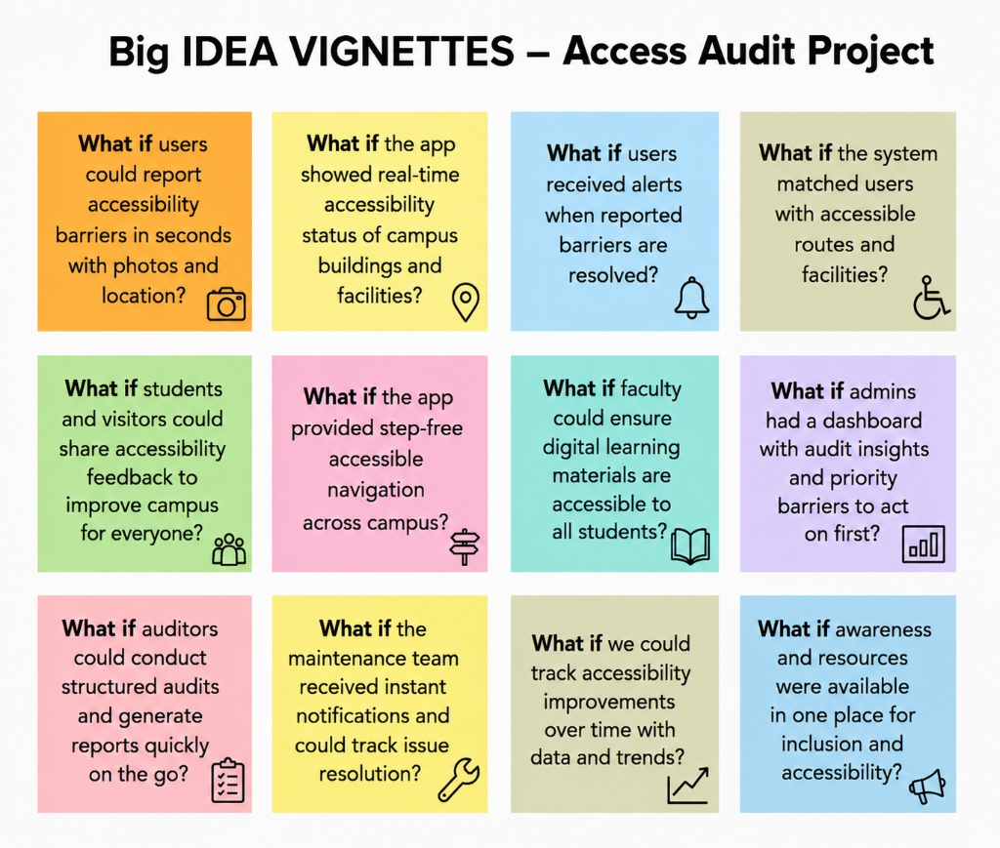
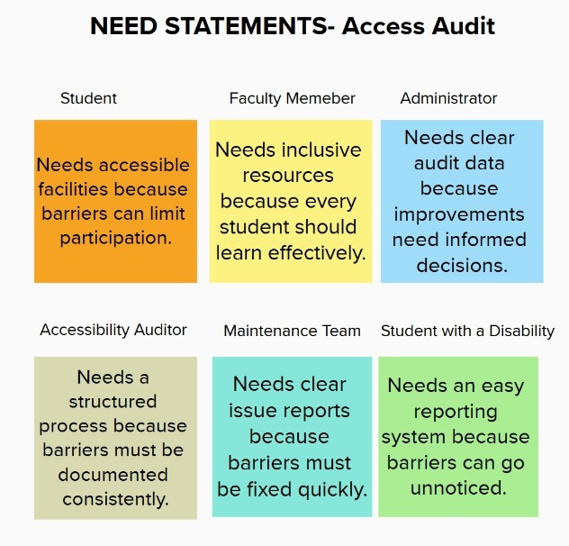
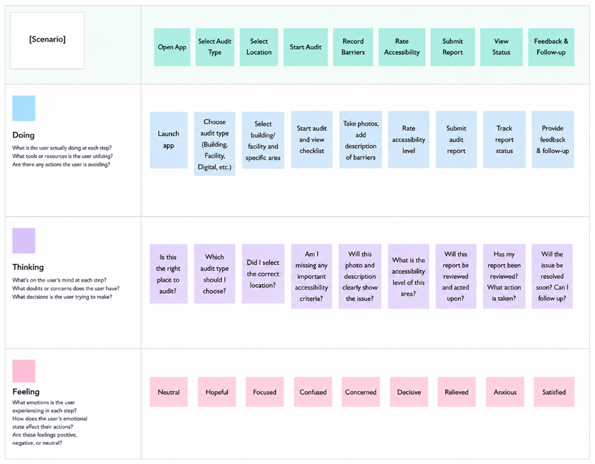
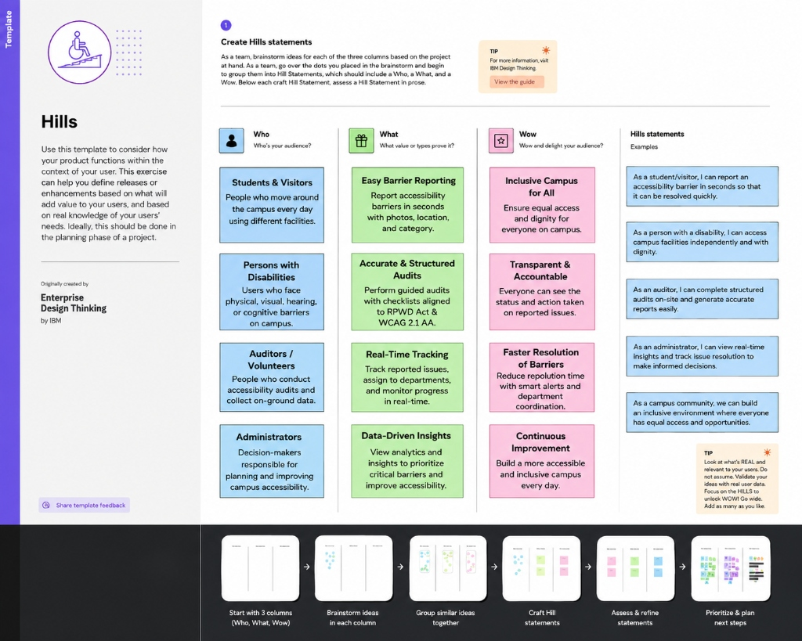
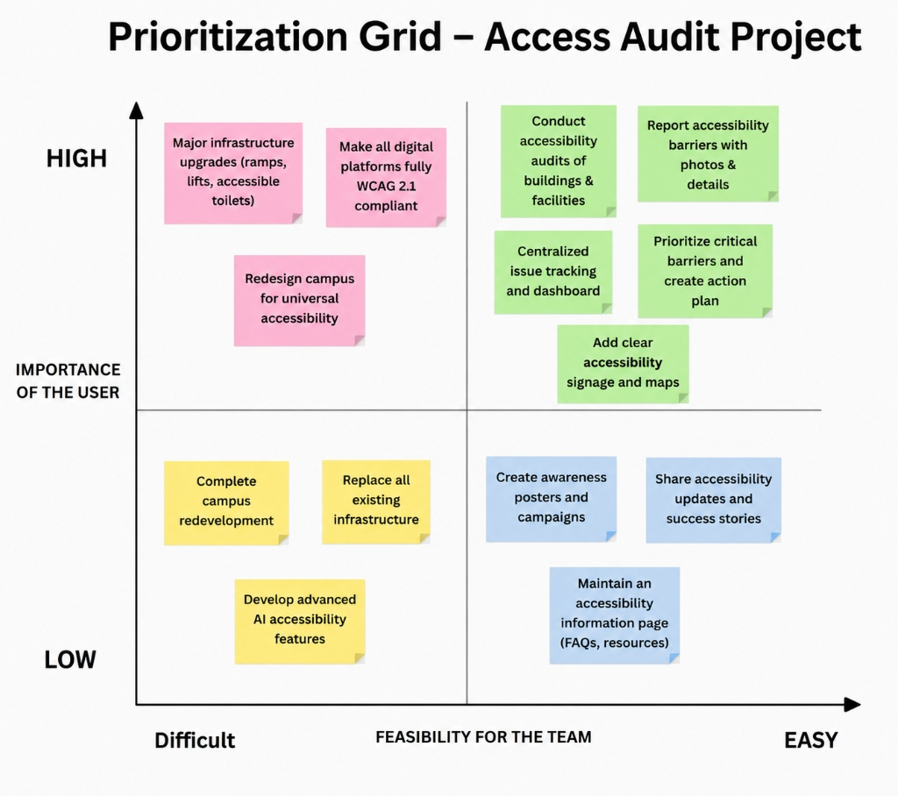

# ♿ S-06: Accessibility Audit & Inclusion Improvement Drive

[](https://github.com/VaibhavTiwari006/S-06-Accessibility-Audit-Inclusion-Improvement-Drive-on-Campus/actions/workflows/ci.yml)


> A comprehensive campus accessibility assessment platform designed to identify, document, and improve physical and digital accessibility across university campuses in accordance with the **Rights of Persons with Disabilities (RPWD) Act, 2016** and **WCAG 2.1 AA** accessibility standards.

---

## ⚡ Quick Start

```bash
# Clone the repository
git clone https://github.com/VaibhavTiwari006/S-06-Accessibility-Audit-Inclusion-Improvement-Drive-on-Campus.git
cd S-06-Accessibility-Audit-Inclusion-Improvement-Drive-on-Campus

# Start all services (Frontend + Backend + Database)
docker-compose up -d --build
```

**Access the application:**
- 🌐 Frontend: http://localhost:3000
- 🔗 Backend API: http://localhost:8080/api
- 📖 API Docs: http://localhost:8080/swagger-ui.html

**Default Credentials:**
| Role | Email | Password |
|------|-------|----------|
| Admin | admin@campus.edu | password |
| Auditor | auditor@campus.edu | password |
| Student | student@campus.edu | password |
| Maintenance | maintenance@campus.edu | password |

---

## 📌 Overview
Accessibility is a fundamental requirement for creating an inclusive educational environment. Many students and staff with disabilities continue to experience barriers while accessing classrooms, laboratories, libraries, administrative offices, campus facilities, and digital platforms.

This project provides a structured framework to evaluate campus accessibility, collect stakeholder feedback, generate actionable recommendations, and assist university administrators in planning accessibility improvements.

The project combines **field audits**, **digital accessibility assessments**, **student participation**, and **data-driven reporting** into a single platform.

---

# 🎯 Problem Statement

Despite legal accessibility requirements, many university campuses continue to contain barriers that restrict equal participation for individuals with disabilities.

Common challenges include:

- Inaccessible entrances and pathways
- Missing ramps or elevators
- Poor tactile guidance for visually impaired users
- Lack of accessible washrooms
- Inadequate classroom accessibility
- Poor website accessibility
- LMS platforms not compliant with accessibility standards
- Insufficient disability awareness among students and staff


These issues reduce educational accessibility and negatively impact the overall campus experience.

---

## 🧠 Design Thinking & Project Strategy

Our platform was built using a structured **IBM Enterprise Design Thinking** approach — from stakeholder analysis through prioritized implementation.

### 💡 Big Idea Vignettes
> *"What if users could report accessibility barriers in seconds?"* — The 12 "What If" questions that sparked the platform.



### 👥 Stakeholder Need Statements
> Each stakeholder's core need mapped to a platform feature — ensuring no user group is left behind.



### 🗺️ User Journey Empathy Map
> Tracking what users **Do**, **Think**, and **Feel** across every step of the audit workflow.



### 🏔️ Hills Statements (Who / What / Wow)
> Measurable outcomes for each stakeholder — connecting *who* benefits, *what* we deliver, and *wow* impact.



### 📊 Prioritization Grid
> Mapping every initiative against **User Importance** vs **Team Feasibility** to focus on what matters most.



---


# 🚀 Project Objectives

The primary objectives of this project are to:

- Conduct comprehensive physical accessibility audits across campus
- Evaluate digital platforms using WCAG 2.1 AA guidelines
- Identify accessibility barriers through evidence-based assessments
- Engage students and staff with disabilities throughout the audit process
- Produce actionable remediation recommendations
- Increase campus-wide awareness regarding accessibility and inclusion
- Support university administration with data-driven decision making
- Promote long-term accessibility improvements

---

# ✨ Key Features

## Physical Accessibility Audit

- Building accessibility inspections
- Ramp evaluation
- Elevator accessibility
- Washroom accessibility
- Classroom accessibility
- Library accessibility
- Laboratory accessibility
- Parking accessibility
- Signage assessment
- Emergency evacuation accessibility

### 🏛️ Real Campus Physical Audit Findings (29 Buildings Audited)

Based on comprehensive ground accessibility audits evaluated under the **Rights of Persons with Disabilities (RPWD) Act, 2016** and **Harmonised Guidelines and Standards for Universal Accessibility in India (2021)**:

- **Lead Accessibility Auditor & Field Researcher**: **Vaibhav Tiwari**
- **Audit Campaign Window**: **July – September 2026**
- **Fieldwork Methodology**: **In-situ on-foot manual physical audit** (steel measuring tapes, rise/run slope calculations, photo evidence)
- **Total Buildings Audited**: **29 buildings** across 7 campus blocks (100% campus academic infrastructure)
- **Metric Checkpoints**: 42 standardized parameters across 8 architectural domains (1,218 total evaluations)
- **Identified Barriers**: **187 discrete physical and environmental barriers** (categorized by severity)
- **Community Feedback**: **Student & peer consultations** on real navigation challenges across campus
- **Campus-Wide Average Accessibility Score**: **68.2%**
- **Complete Research Dossier**: See the dedicated [**`research/`**](research/) repository folder:
  - 📋 [**Executive Research Dossier**](research/README.md)
  - ⏱️ [**Fieldwork Inspection Schedule & Log**](research/FIELD_METRICS_AND_HOURS.md)
  - 📖 [**Comprehensive 29-Building Audit Logbook**](research/BUILDING_AUDIT_LOGBOOK.md)
  - 🔬 [**Manual Fieldwork Inspection Protocol**](research/FIELDWORK_METHODOLOGY.md)
  - 🚧 [**Barrier Taxonomy & 187 Field Findings**](research/BARRIER_TAXONOMY_AND_FINDINGS.md)
  - 🎙️ [**Student Feedback & Campus Observations**](research/STAKEHOLDER_INTERVIEWS.md)
  - 📊 [**Raw Excel Survey Dataset**](docs/Campus_Accessibility_Audit_Survey.xlsx)

| Block | Buildings Audited | Overall Score | RPWD Compliance Status | Key Findings & Ground Assessment |
|---|---|---|---|---|
| **A Block** | A1, A2, A3 | **96.7%** | 🟢 Compliant | State-of-the-art universal design: full lift & ramp access, braille indicators, accessible washrooms, lowered reception |
| **C Block** | C1, C2, C3 | **73.2%** | 🟡 Partial | C1/C2 (79.7%) feature excellent signage & wide doors; C3 (60.3%) requires washroom grab bar upgrades |
| **D Block** | D1, D2, D3, D4, D5, D6, D7, D8 | **74.8%** | 🟡 Partial | Step-free ramp entrances, broad corridors, accessible parking bays, and accessible washroom stalls |
| **Nek Chand (NC)** | NC 1, NC 2, NC 3, NC 4, NC 5 | **62.9%** | 🟡 Partial | Modern academic complex with step-free entrances & spacious lifts; lacks tactile room numbering and visual alarms |
| **B Block** | B1, B2, B3, B4, B5 | **59.8%** | 🟡 Partial | Wide double-door entrances and obstruction-free pathways; active retrofit drive underway |
| **Zakir Husain** | Zakir A, Zakir B, Zakir C | **57.2%** | 🟡 Partial | High-capacity lecture complex; requires portico entrance ramp reconstruction and elevator auditory floor voice units |
| **DD Block** | DD1, DD2 | **41.6%** | 🔴 Non-Compliant | Multi-story wing lacking elevator infrastructure; upper floor access restricted to stairs (priority 1 remediation) |

#### 📊 Audits by Lifecycle Status (29 Total Audits)
* 🟢 **APPROVED (18 Audits · 62%)**: A1–A3, C1–C3, D1–D8, NC 1, NC 3, NC 4, NC 5 meeting statutory thresholds.
* 🔵 **IN PROGRESS (5 Audits · 17%)**: B1–B5 undergoing active on-site physical accessibility retrofits.
* 🟡 **PENDING (4 Audits · 14%)**: Zakir A–C & NC 2 awaiting tactile signage verification and final sign-off.
* 🔴 **REJECTED (2 Audits · 7%)**: DD1 & DD2 non-compliant due to lack of multi-storey elevator vertical circulation.

---

### 🏆 Departmental Accessibility Comparison (Ground Survey Benchmarks)

Empirical WCAG 2.1 & RPWD compliance metrics across university academic departments:

| Department Code | Academic Department Name | Campus Block Location | Compliance Score | Status Rating | Barriers Fixed / Pending | 12-Wk Growth |
|:---:|:---|:---|:---:|:---:|:---:|:---:|
| **CSE** | **Computer Science & Engineering** | **Block A (A1–A3)** | **96.7%** 🏆 | 🟢 Compliant (Universal Design) | 26 Fixed • 1 Pending | **+8.2%** |
| **UIC** | **University Institute of Computing** | **Block C (C1–C3)** | **79.7%** | 🟢 Substantially Compliant | 21 Fixed • 3 Pending | **+4.8%** |
| **CBS** | **Chandigarh Business School** | **Block D (D1–D8)** | **74.8%** | 🟡 Partial Compliance | 18 Fixed • 5 Pending | **+3.8%** |
| **UIPS** | **Pharmaceutical Sciences** | **Nek Chand (NC 1–5)** | **62.9%** | 🟡 Partial Compliance | 13 Fixed • 8 Pending | **+5.2%** |
| **UIET** | **Engineering & Technology** | **Block B (B1–B5)** | **59.8%** | 🔵 In Progress (Retrofit Drive) | 11 Fixed • 9 Pending | **+3.4%** |

> **Campus Average Departmental Growth:** **+5.1%** progress across academic complexes.

---

## Digital Accessibility Audit

- University Website Audit
- Learning Management System (LMS)
- Student Portal
- Mobile Responsiveness
- Keyboard Navigation
- Screen Reader Compatibility
- Color Contrast Analysis
- Image Alt Text Validation
- Form Accessibility
- ARIA Compliance

---

## Survey & Feedback System

- Student accessibility surveys
- Faculty feedback
- Staff feedback
- Anonymous reporting
- Issue categorization
- Suggestion collection

---

## Dashboard & Reporting

- Accessibility statistics
- Audit progress tracking
- Barrier categorization
- Priority-based issue management
- Report generation
- Visual analytics

---

# 🏗️ Technology Stack

### Frontend

- React.js
- Vite
- HTML5
- CSS3
- JavaScript (ES6)

### Backend

- Spring Boot
- Spring Security
- JWT Authentication
- Spring Data JPA
- REST APIs

### Database

- PostgreSQL

### Documentation

- OpenAPI / Swagger
- Markdown
- Architecture Diagrams

---

# 📂 Project Structure

```
S-06-Accessibility-Audit/
│
├── frontend/                   # React 18 + Vite + Tailwind CSS + Framer Motion UI
├── backend/                    # Spring Boot 3.4.1 (Java 21) REST API + Spring Security
├── database/                   # PostgreSQL schemas and seed initialization
├── research/                   # Fieldwork dossier & ground empirical data
│   ├── README.md               # Executive research summary & regulatory framework
│   ├── FIELD_METRICS_AND_HOURS.md # Phased inspection log & walkthrough schedule
│   ├── BUILDING_AUDIT_LOGBOOK.md  # Detailed 29-building inspection ledger
│   ├── FIELDWORK_METHODOLOGY.md   # Manual inspection toolkit & 42-parameter protocol
│   ├── BARRIER_TAXONOMY_AND_FINDINGS.md # 187 Classified barriers & remediation guide
│   └── STAKEHOLDER_INTERVIEWS.md  # Student feedback & campus community observations
├── docs/                       # Architectural, requirements, and compliance specs
│   ├── architecture/           # System architecture, DB schema & component diagrams
│   ├── requirements/           # SRS, user stories & functional requirements
│   ├── Campus_Accessibility_Audit_Survey.xlsx # Complete quantitative Excel audit dataset
│   ├── TECHNICAL_REPORT.md     # Comprehensive project technical report
│   ├── API_DOCUMENTATION.md    # REST API endpoints & Swagger schemas
│   ├── INSTALLATION.md         # Local & Docker installation guide
│   ├── DEPLOYMENT.md           # Production deployment & Nginx guide
│   └── TESTING_REPORT.md       # JUnit test suite & coverage documentation
│
├── CHANGELOG.md                # Detailed version release notes
├── SECURITY.md                 # Security policy & vulnerability reporting
├── CONTRIBUTING.md             # Open source contribution guidelines
├── CODE_OF_CONDUCT.md          # Contributor code of conduct
├── README.md                   # Project overview & quick start
└── LICENSE                     # MIT License
```

---

# 👥 Stakeholders

| Stakeholder | Responsibility |
|------------|----------------|
| Students with Disabilities | Primary beneficiaries and participants |
| Faculty Members | Feedback and implementation support |
| University Administration | Decision making and policy implementation |
| Campus Facilities Team | Infrastructure improvements |
| Disability Rights Organizations | Advisory support |
| General Student Community | Awareness and participation |

---

# 📋 Audit Scope

## Physical Infrastructure

- Academic Blocks
- Administrative Buildings
- Libraries
- Laboratories
- Hostels
- Cafeterias
- Parking Areas
- Walkways
- Entrances
- Emergency Exits

---

## Digital Platforms

- University Website
- Student Portal
- Learning Management System
- Online Forms
- Internal Web Applications

---

# 📅 Implementation Timeline

| Week | Milestone |
|------|-----------|
| Week 1 | Research, stakeholder analysis, audit planning |
| Week 2 | Physical accessibility assessment |
| Week 3 | Digital accessibility evaluation |
| Week 4 | User surveys and participatory sessions |
| Week 5 | Awareness campaign and remediation planning |
| Week 6 | Final reporting and presentation |

---


---

# 📦 Expected Deliverables

- Comprehensive Physical Accessibility Audit
- Digital Accessibility Compliance Report
- Accessibility Scorecard
- Evidence-Based Documentation
- Student Survey Analysis
- Priority-wise Remediation Roadmap
- Awareness Campaign Materials
- Administrative Policy Recommendations
- Final Project Report

---

# 📚 Documentation

Detailed project documentation is available below.

| Document | Description |
|----------|-------------|
| [🔬 Research Overview](research/README.md) | Executive research summary & regulatory framework |
| [⏱️ Field Inspection Log](research/FIELD_METRICS_AND_HOURS.md) | Phased inspection log & walkthrough schedule |
| [📖 29-Building Audit Logbook](research/BUILDING_AUDIT_LOGBOOK.md) | Detailed building inspection & defect ledger |
| [📐 Fieldwork Methodology](research/FIELDWORK_METHODOLOGY.md) | Manual inspection toolkit & 42-parameter protocol |
| [🚧 Barrier Taxonomy](research/BARRIER_TAXONOMY_AND_FINDINGS.md) | 187 Classified barriers & remediation guide |
| [🎙️ Student Feedback & Observations](research/STAKEHOLDER_INTERVIEWS.md) | Student feedback & campus community observations |
| [📊 Excel Audit Dataset](docs/Campus_Accessibility_Audit_Survey.xlsx) | Complete quantitative Excel audit dataset |
| [📋 Technical Report](docs/TECHNICAL_REPORT.md) | Comprehensive final project report |
| [📖 Installation Guide](docs/INSTALLATION.md) | Setup and deployment instructions |
| [👤 User Guide](docs/USER_GUIDE.md) | Role-based usage instructions |
| [📑 API Documentation](docs/API_DOCUMENTATION.md) | REST endpoint specifications |
| [🏗️ System Architecture](docs/architecture/system-architecture.md) | Three-tier architecture overview |
| [🗄️ Database Schema](docs/architecture/DATABASE_SCHEMA.md) | ER diagrams and table definitions |
| [🧪 Testing Report](docs/TESTING_REPORT.md) | Test strategy and results |
| [🚀 Deployment Guide](docs/DEPLOYMENT.md) | Production deployment with Docker & Nginx |
| [📝 Changelog](CHANGELOG.md) | Version history and release notes |
| [🔒 Security Policy](SECURITY.md) | Vulnerability disclosure and security measures |
| [📖 SRS](docs/requirements/software-requirement-specification.md) | Software Requirement Specification |
| [📋 User Stories](docs/requirements/user-stories.md) | 21 user stories across 5 roles |
| [✅ Functional Requirements](docs/requirements/functional-requirements.md) | 19 functional requirements |
| [⚙️ Non-Functional Requirements](docs/requirements/non-functional-requirements.md) | 8 non-functional requirements |

---

# ⚖️ Compliance Standards

This project follows internationally recognized accessibility standards, including:

- Rights of Persons with Disabilities (RPWD) Act, 2016
- Web Content Accessibility Guidelines (WCAG) 2.1 Level AA
- Universal Design Principles
- Inclusive Education Best Practices

---

# 🌍 Expected Impact

This initiative aims to create a more inclusive university ecosystem by:

- Improving accessibility awareness
- Supporting evidence-based infrastructure improvements
- Encouraging participatory governance
- Enhancing digital accessibility
- Promoting equal educational opportunities
- Assisting institutions in meeting legal accessibility requirements

---

# 🛡️ CI/CD & Security Architecture

To support scalability and code reliability, this repository integrates:
*   **GitHub Actions CI Workflow**: Automates Spring Boot unit tests and Node.js Vite asset compilation on every push or pull request.
*   **BCrypt Password Encryption**: Implemented for all user credential storage.
*   **SQL Parameterization**: Enforced via Spring Data JPA Hibernate layers to prevent SQL injections.
*   **Security Contact Email**: [vaibhav.cse006@gmail.com](mailto:vaibhav.cse006@gmail.com) (48-hour SLA for confidential vulnerability disclosure)

---

# 🤝 Contributing & Community

We welcome community collaborations! Please review our:
*   [**Contributing Guidelines**](CONTRIBUTING.md)
*   [**Code of Conduct**](CODE_OF_CONDUCT.md)
*   [**Security Policy**](SECURITY.md) — Security Contact: [vaibhav.cse006@gmail.com](mailto:vaibhav.cse006@gmail.com)

---

# 📄 License

This project is developed as part of the **CUSOC Social Innovation Initiative** for educational and research purposes.
