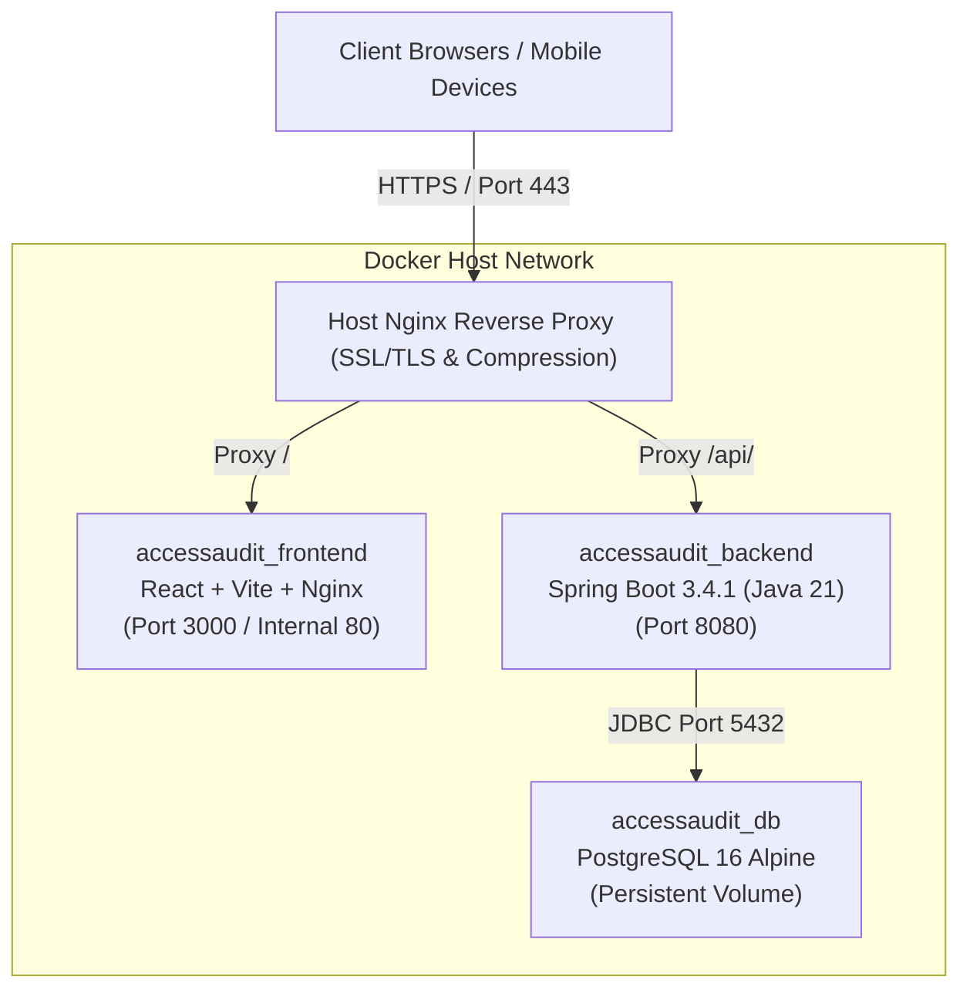

# Production Deployment Guide — AccessAudit

This guide provides step-by-step instructions for deploying the **AccessAudit** platform to a production environment. AccessAudit is an enterprise campus accessibility auditing and inclusion management application designed to evaluate, track, and remediate physical and digital accessibility barriers across university facilities.

---

## Table of Contents

1. [Architecture Overview](#1-architecture-overview)
2. [Prerequisites & System Requirements](#2-prerequisites--system-requirements)
3. [Environment Variables Configuration](#3-environment-variables-configuration)
4. [Docker Compose Production Deployment](#4-docker-compose-production-deployment)
5. [Database Setup & Migrations](#5-database-setup--migrations)
6. [Nginx Reverse Proxy Configuration](#6-nginx-reverse-proxy-configuration)
7. [SSL/TLS Configuration (Let's Encrypt)](#7-ssltls-configuration-lets-encrypt)
8. [Health Checks & System Monitoring](#8-health-checks--system-monitoring)
9. [Backup & Disaster Recovery](#9-backup--disaster-recovery)
10. [Scaling & Performance Considerations](#10-scaling--performance-considerations)
11. [Troubleshooting & Maintenance Runbook](#11-troubleshooting--maintenance-runbook)

---

## 1. Architecture Overview

AccessAudit is built on a containerized **Three-Tier Architecture**:



### Technology Stack Matrix

| Component | Technology | Version | Purpose |
| :--- | :--- | :--- | :--- |
| **Frontend** | React, Vite, Tailwind CSS, Lucide Icons | Node 20 / Alpine | User interface, audit forms, dashboards, and reporting |
| **Backend** | Spring Boot, Spring Security, Spring Data JPA | 3.4.1 (Java 21) | REST API, authentication, RBAC, business logic |
| **Database** | PostgreSQL | 16-alpine (or 15-alpine) | Relational storage for users, buildings, audits, and tasks |
| **Web Server** | Nginx | 1.25+ | Static file serving, SSL termination, reverse proxying |
| **Orchestration**| Docker Engine & Docker Compose | Compose v2.20+ | Multi-container lifecycle management |

---

## 2. Prerequisites & System Requirements

### Hardware Requirements

| Specification | Minimum (Demo / Staging) | Recommended (Production) | High Traffic Campus (>10k users) |
| :--- | :--- | :--- | :--- |
| **vCPU** | 2 Cores | 4 Cores | 8 Cores |
| **RAM** | 4 GB | 8 GB | 16 GB |
| **Disk Space** | 20 GB SSD | 50 GB NVMe SSD | 150+ GB NVMe SSD |
| **Network** | 100 Mbps | 1 Gbps | 1 Gbps |

### Operating System & Software

- **Operating System**: Ubuntu 22.04 LTS / 24.04 LTS, Debian 12, RHEL 9, or Windows Server 2022.
- **Docker Engine**: Version `24.0.0` or higher.
- **Docker Compose**: Plugin version `v2.20.0` or higher.
- **Git**: Version `2.40.0` or higher.
- **OpenSSL**: For generating secure cryptographic secrets.

### Network & Firewall Rules

Ensure the following inbound and outbound firewall rules are configured on the hosting server:

```bash
# Allow SSH access
sudo ufw allow 22/tcp

# Allow HTTP and HTTPS traffic
sudo ufw allow 80/tcp
sudo ufw allow 443/tcp

# Enable Firewall
sudo ufw enable
```

> [!IMPORTANT]
> Do **NOT** expose ports `5432` (PostgreSQL) or `8080` (Backend API directly) to the public internet in production. All incoming external traffic should be routed through the Nginx reverse proxy on ports `80` and `443`.

---

## 3. Environment Variables Configuration

In production, never rely on default credentials or hardcoded secret keys. Create a dedicated `.env` file in the project root directory.

### Production Environment Variables Template (`.env`)

Create `c:\Users\Vaibhav\Desktop\AccessAudit\.env` (or on Linux `/opt/accessaudit/.env`):

```env
# =================================================================
# AccessAudit Production Environment Configuration
# =================================================================

# --- Application Environment ---
ENVIRONMENT=production
SPRING_PROFILES_ACTIVE=prod

# --- PostgreSQL Database Credentials ---
POSTGRES_DB=accessaudit
POSTGRES_USER=accessaudit_admin
POSTGRES_PASSWORD=CHANGE_ME_TO_A_SECURE_RANDOM_PASSWORD_32_CHARS
POSTGRES_PORT=5432

# --- Backend Spring Data Source ---
SPRING_DATASOURCE_URL=jdbc:postgresql://postgres:5432/accessaudit
SPRING_DATASOURCE_USERNAME=accessaudit_admin
SPRING_DATASOURCE_PASSWORD=CHANGE_ME_TO_A_SECURE_RANDOM_PASSWORD_32_CHARS

# --- JWT Authentication (HMAC-SHA256 Secret) ---
# Generate with: openssl rand -base64 64
APP_JWT_SECRET=c29tZXNlY3VyZXJhbmRvbWJhc2U2NHN0cmluZ2ZvcmFjY2Vzc2F1ZGl0cHJvZHVjdGlvbnVzYWdlMTIzNDU2Nzg5MA==
APP_JWT_EXPIRATION_MS=86400000

# --- Server & CORS Configuration ---
SERVER_PORT=8080
CORS_ALLOWED_ORIGINS=https://accessaudit.campus.edu,https://www.accessaudit.campus.edu

# --- Frontend Build Arguments ---
VITE_API_BASE_URL=https://accessaudit.campus.edu/api

# --- Domain & SSL ---
DOMAIN_NAME=accessaudit.campus.edu
ADMIN_EMAIL=admin@campus.edu
```

### Generating Strong Cryptographic Keys

Generate a secure 512-bit Base64-encoded secret for `APP_JWT_SECRET`:

```bash
# Linux / macOS / Git Bash
openssl rand -base64 64

# Windows PowerShell
$bytes = New-Object Byte[] 64
[Security.Cryptography.RandomNumberGenerator]::Create().GetBytes($bytes)
[Convert]::ToBase64String($bytes)
```

Generate a secure database password:

```bash
# Linux / macOS
openssl rand -hex 24

# PowerShell
-join ((65..90) + (97..122) + (48..57) | Get-Random -Count 28 | ForEach-Object {[char]$_})
```

> [!CAUTION]
> Always add `.env` and `*.env.local` to `.gitignore`. Never commit production passwords, connection strings, or JWT signing keys into version control.

---

## 4. Docker Compose Production Deployment

The platform provides a modular multi-container orchestration definition using Docker Compose.

### Production `docker-compose.yml`

```yaml
version: '3.8'

services:
  postgres:
    image: postgres:16-alpine
    container_name: accessaudit_db
    restart: unless-stopped
    environment:
      POSTGRES_USER: ${POSTGRES_USER:-postgres}
      POSTGRES_PASSWORD: ${POSTGRES_PASSWORD}
      POSTGRES_DB: ${POSTGRES_DB:-accessaudit}
      PGDATA: /var/lib/postgresql/data/pgdata
    volumes:
      - postgres_data:/var/lib/postgresql/data
    healthcheck:
      test: ["CMD-SHELL", "pg_isready -U ${POSTGRES_USER:-postgres} -d ${POSTGRES_DB:-accessaudit}"]
      interval: 10s
      timeout: 5s
      retries: 5
      start_period: 15s
    networks:
      - accessaudit_internal
    # Do not expose ports to host in production; only internal network access

  backend:
    build:
      context: ./backend
      dockerfile: Dockerfile
    container_name: accessaudit_backend
    restart: unless-stopped
    environment:
      - SPRING_PROFILES_ACTIVE=prod
      - SPRING_DATASOURCE_URL=${SPRING_DATASOURCE_URL}
      - SPRING_DATASOURCE_USERNAME=${SPRING_DATASOURCE_USERNAME}
      - SPRING_DATASOURCE_PASSWORD=${SPRING_DATASOURCE_PASSWORD}
      - APP_JWT_SECRET=${APP_JWT_SECRET}
      - APP_JWT_EXPIRATION_MS=${APP_JWT_EXPIRATION_MS:-86400000}
      - SERVER_PORT=8080
      - JAVA_OPTS=-Xms512m -Xmx2048m -XX:+UseG1GC
    ports:
      - "127.0.0.1:8080:8080"
    depends_on:
      postgres:
        condition: service_healthy
    networks:
      - accessaudit_internal
    healthcheck:
      test: ["CMD-SHELL", "wget -q --spider http://localhost:8080/api-docs || exit 1"]
      interval: 15s
      timeout: 5s
      retries: 5
      start_period: 30s

  frontend:
    build:
      context: ./frontend
      dockerfile: Dockerfile
      args:
        - VITE_API_BASE_URL=${VITE_API_BASE_URL}
    container_name: accessaudit_frontend
    restart: unless-stopped
    ports:
      - "127.0.0.1:3000:80"
    depends_on:
      - backend
    networks:
      - accessaudit_internal
    healthcheck:
      test: ["CMD-SHELL", "wget -q --spider http://localhost:80/ || exit 1"]
      interval: 15s
      timeout: 5s
      retries: 3
      start_period: 10s

volumes:
  postgres_data:
    name: accessaudit_postgres_data
    driver: local

networks:
  accessaudit_internal:
    name: accessaudit_network
    driver: bridge
```

### Step-by-Step Deployment Commands

1. **Clone the Repository**:
   ```bash
   git clone https://github.com/VaibhavTiwari006/S-06-Accessibility-Audit-Inclusion-Improvement-Drive-on-Campus.git /opt/accessaudit
   cd /opt/accessaudit
   ```

2. **Create and Secure the `.env` File**:
   ```bash
   cp .env.example .env
   chmod 600 .env
   nano .env
   ```

3. **Build and Launch Services**:
   ```bash
   docker compose up -d --build
   ```

4. **Verify Container Health**:
   ```bash
   docker compose ps
   ```

   All containers (`accessaudit_db`, `accessaudit_backend`, `accessaudit_frontend`) should report `healthy` or `running`.

5. **Follow Backend Initialization Logs**:
   ```bash
   docker compose logs -f backend
   ```

---

## 5. Database Setup & Migrations

### Automatic DDL Management & Hibernate

The Spring Boot backend uses **Hibernate 6.x** / Spring Data JPA to automatically manage relational schemas in PostgreSQL.

In production:
- `spring.jpa.hibernate.ddl-auto=update`: Safely applies new columns, tables, indices, and constraints without dropping existing data.
- PostgreSQL Dialect: `org.hibernate.dialect.PostgreSQLDialect` handles efficient mapping of UUIDs, JSONB columns, arrays, and standard SQL types.

### Seed Data (`DatabaseInitializer.java`)

When the database is launched for the first time, `DatabaseInitializer` executes automatically on application startup if the `users` table is empty (`userRepository.count() == 0`).

The seeder populates:
1. **12 Default Users** across 4 role tiers (`ADMIN`, `AUDITOR`, `STUDENT`, `MAINTENANCE`).
2. **12 Campus Buildings** (e.g., Main Academic Block, Central Library, Student Activity Centre, Hostels).
3. **18 Accessibility Checklist Items** across 5 categories:
   - Physical Infrastructure (Ramps, Restrooms, Elevators, Tactile paths)
   - Digital Resources (Kiosks, LMS contrast, Screen reader labs)
   - Signage & Wayfinding (Font sizes, Braille signs, Luminescent exits)
   - Emergency Preparedness (Disability evacuation plans, Strobe fire alarms)
   - Inclusive Facilities (Sensory rooms, Wheelchair water fountains, Reserved seating)
4. **8 Comprehensive Audits** with detailed category evaluations.
5. **12 Participatory Student Reports** regarding real-time barriers.
6. **50 Remediation & Maintenance Tasks** prioritized by RPWD Act 2016 and WCAG 2.1 AA criteria.

### Initial Seed Credentials

| Role | Email | Default Password | Initial Action Required |
| :--- | :--- | :--- | :--- |
| **Admin** | `admin@campus.edu` | `admin123` | **Rotate password immediately** |
| **Admin (Secondary)** | `meena.gupta@campus.edu` | `admin123` | **Rotate password immediately** |
| **Auditor** | `auditor@campus.edu` | `auditor123` | Rotate password upon login |
| **Auditor** | `priya.singh@campus.edu` | `auditor123` | Rotate password upon login |
| **Auditor** | `amit.verma@campus.edu` | `auditor123` | Rotate password upon login |
| **Student** | `student@campus.edu` | `student123` | Individual student account |
| **Maintenance** | `maintenance@campus.edu` | `maintenance123` | Maintenance team login |

> [!WARNING]
> After launching in production, immediately log into the Admin portal and update all default administrative credentials to comply with campus cybersecurity policies.

---

## 6. Nginx Reverse Proxy Configuration

To expose AccessAudit securely to end users, configure an Nginx reverse proxy on the host system that routes incoming traffic to the appropriate frontend (port `3000`) and backend API (port `8080`) containers.

### Host Nginx Configuration File

Create `/etc/nginx/sites-available/accessaudit.conf`:

```nginx
# Upstream Definitions
upstream frontend_upstream {
    server 127.0.0.1:3000;
    keepalive 32;
}

upstream backend_upstream {
    server 127.0.0.1:8080;
    keepalive 32;
}

# HTTP — Redirect all traffic to HTTPS
server {
    listen 80;
    listen [::]:80;
    server_name accessaudit.campus.edu www.accessaudit.campus.edu;

    # Let's Encrypt ACME challenge location
    location /.well-known/acme-challenge/ {
        root /var/www/certbot;
    }

    location / {
        return 301 https://$host$request_uri;
    }
}

# HTTPS — Production Server Block
server {
    listen 443 ssl http2;
    listen [::]:443 ssl http2;
    server_name accessaudit.campus.edu www.accessaudit.campus.edu;

    # SSL Certificates (managed by Certbot)
    ssl_certificate /etc/letsencrypt/live/accessaudit.campus.edu/fullchain.pem;
    ssl_certificate_key /etc/letsencrypt/live/accessaudit.campus.edu/privkey.pem;
    ssl_trusted_certificate /etc/letsencrypt/live/accessaudit.campus.edu/chain.pem;

    # SSL Optimization & Security
    ssl_protocols TLSv1.2 TLSv1.3;
    ssl_ciphers ECDHE-ECDSA-AES128-GCM-SHA256:ECDHE-RSA-AES128-GCM-SHA256:ECDHE-ECDSA-AES256-GCM-SHA384:ECDHE-RSA-AES256-GCM-SHA384:DHE-RSA-AES128-GCM-SHA256:DHE-RSA-AES256-GCM-SHA384;
    ssl_prefer_server_ciphers off;
    ssl_session_timeout 1d;
    ssl_session_cache shared:SSL:10m;
    ssl_session_tickets off;
    ssl_stapling on;
    ssl_stapling_verify on;

    # Security Headers
    add_header X-Frame-Options "SAMEORIGIN" always;
    add_header X-Content-Type-Options "nosniff" always;
    add_header X-XSS-Protection "1; mode=block" always;
    add_header Referrer-Policy "strict-origin-when-cross-origin" always;
    add_header Content-Security-Policy "default-src 'self'; script-src 'self' 'unsafe-inline'; style-src 'self' 'unsafe-inline'; img-src 'self' data: https:; font-src 'self' data:; connect-src 'self' https://accessaudit.campus.edu;" always;
    add_header Strict-Transport-Security "max-age=63072000; includeSubDomains; preload" always;

    # Max Request Size (for photographic evidence and PDF reports)
    client_max_body_size 30M;

    # Gzip Compression
    gzip on;
    gzip_vary on;
    gzip_min_length 1024;
    gzip_proxied any;
    gzip_comp_level 6;
    gzip_types text/plain text/css text/xml application/json application/javascript application/xml+rss application/atom+xml image/svg+xml;

    # 1. API Route -> Spring Boot Backend
    location /api/ {
        proxy_pass http://backend_upstream;
        proxy_http_version 1.1;

        proxy_set_header Host $host;
        proxy_set_header X-Real-IP $remote_addr;
        proxy_set_header X-Forwarded-For $proxy_add_x_forwarded_for;
        proxy_set_header X-Forwarded-Proto $scheme;
        proxy_set_header X-Forwarded-Port $server_port;

        # Timeouts for heavy audit report generation
        proxy_connect_timeout 60s;
        proxy_send_timeout 120s;
        proxy_read_timeout 120s;

        proxy_buffering on;
        proxy_buffer_size 128k;
        proxy_buffers 4 256k;
        proxy_busy_buffers_size 256k;
    }

    # 2. Swagger / OpenAPI Documentation
    location ~* ^/(swagger-ui|api-docs) {
        proxy_pass http://backend_upstream;
        proxy_set_header Host $host;
        proxy_set_header X-Real-IP $remote_addr;
        proxy_set_header X-Forwarded-For $proxy_add_x_forwarded_for;
        proxy_set_header X-Forwarded-Proto $scheme;
    }

    # 3. Frontend Single Page Application
    location / {
        proxy_pass http://frontend_upstream;
        proxy_http_version 1.1;

        proxy_set_header Host $host;
        proxy_set_header X-Real-IP $remote_addr;
        proxy_set_header X-Forwarded-For $proxy_add_x_forwarded_for;
        proxy_set_header X-Forwarded-Proto $scheme;
        proxy_set_header Upgrade $http_upgrade;
        proxy_set_header Connection "upgrade";

        # Disable caching for index.html
        location = /index.html {
            proxy_pass http://frontend_upstream;
            add_header Cache-Control "no-store, no-cache, must-revalidate";
        }
    }
}
```

### Enable Nginx Site Configuration

```bash
# Enable the site
sudo ln -s /etc/nginx/sites-available/accessaudit.conf /etc/nginx/sites-enabled/

# Test syntax
sudo nginx -t

# Reload Nginx
sudo systemctl reload nginx
```

---

## 7. SSL/TLS Configuration (Let's Encrypt)

Secure your deployment with free, automated SSL certificates from Let's Encrypt using Certbot.

### 1. Install Certbot

```bash
sudo apt update
sudo apt install -y certbot python3-certbot-nginx
```

### 2. Obtain SSL Certificate

Execute Certbot with the Nginx plugin:

```bash
sudo certbot --nginx -d accessaudit.campus.edu -d www.accessaudit.campus.edu \
  --agree-tos \
  --email admin@campus.edu \
  --non-interactive
```

### 3. Verify Automated Certificate Renewal

Certbot sets up an automated renewal timer (`certbot.timer` in systemd). Test the renewal process:

```bash
sudo certbot renew --dry-run
```

To view timer status:
```bash
sudo systemctl status certbot.timer
```

---

## 8. Health Checks & System Monitoring

Continuous monitoring ensures maximum availability of campus accessibility services.

### Health Check Endpoints

| Component | Target URL / Check | Expected Status |
| :--- | :--- | :--- |
| **Frontend Portal** | `http://localhost:3000/` | `HTTP 200 OK` |
| **Backend API** | `http://localhost:8080/api-docs` | `HTTP 200 OK` (JSON API Schema) |
| **Database** | `pg_isready -U postgres -d accessaudit` | `accepting connections` |

### Docker Health Checks & Auto-Restart

Each container includes a built-in Docker `healthcheck` definition in `docker-compose.yml`. Inspect health statuses with:

```bash
# Check status and health tags
docker compose ps

# Detailed health check diagnostic logs
docker inspect --format='{{json .State.Health}}' accessaudit_backend | jq .
```

### Container Logging & Log Rotation

To prevent disk exhaustion from verbose production logs, configure Docker log rotation in `/etc/docker/daemon.json`:

```json
{
  "log-driver": "json-file",
  "log-opts": {
    "max-size": "20m",
    "max-file": "5"
  }
}
```

Restart the Docker daemon after updating:
```bash
sudo systemctl restart docker
```

To stream live logs in production:
```bash
# Stream all logs
docker compose logs -f --tail=100

# Stream backend only
docker compose logs -f --tail=100 backend

# Stream database queries and connections
docker compose logs -f postgres
```

---

## 9. Backup & Disaster Recovery

A reliable backup strategy is vital for preserving audit records, student compliance reports, and evidence trails.

### Manual Database Backup (`pg_dump`)

Create an immediate compressed SQL snapshot of the PostgreSQL database:

```bash
# Create backup directory
mkdir -p /opt/accessaudit/backups

# Dump database to compressed archive
docker compose exec -T postgres pg_dump -U accessaudit_admin accessaudit | gzip > /opt/accessaudit/backups/accessaudit_backup_$(date +%Y%m%d_%H%M%S).sql.gz
```

### Automated Nightly Backup Script

Create `/opt/accessaudit/scripts/backup_db.sh`:

```bash
#!/usr/bin/env bash
set -euo pipefail

BACKUP_DIR="/opt/accessaudit/backups"
TIMESTAMP=$(date +"%Y%m%d_%H%M%S")
RETENTION_DAYS=14
BACKUP_FILE="${BACKUP_DIR}/accessaudit_${TIMESTAMP}.sql.gz"

mkdir -p "${BACKUP_DIR}"

echo "[$(date)] Starting AccessAudit PostgreSQL backup..."
docker compose -f /opt/accessaudit/docker-compose.yml exec -T postgres \
  pg_dump -U accessaudit_admin accessaudit | gzip > "${BACKUP_FILE}"

echo "[$(date)] Backup completed successfully: ${BACKUP_FILE}"

# Delete backups older than RETENTION_DAYS
find "${BACKUP_DIR}" -type f -name "accessaudit_*.sql.gz" -mtime +${RETENTION_DAYS} -exec rm -f {} \;
echo "[$(date)] Cleaned up backups older than ${RETENTION_DAYS} days."
```

Make the script executable:
```bash
chmod +x /opt/accessaudit/scripts/backup_db.sh
```

### Cron Schedule

Schedule daily execution at 02:00 AM:

```bash
# Open crontab editor
crontab -e

# Append scheduled job:
0 2 * * * /opt/accessaudit/scripts/backup_db.sh >> /var/log/accessaudit_backup.log 2>&1
```

### Disaster Recovery: Database Restoration

To restore the database from a backup file:

1. **Stop the Backend Application** (to terminate active connection pools):
   ```bash
   docker compose stop backend
   ```

2. **Restore Database from SQL Backup**:
   ```bash
   gunzip -c /opt/accessaudit/backups/accessaudit_backup_20260817_000000.sql.gz | \
     docker compose exec -T postgres psql -U accessaudit_admin -d accessaudit
   ```

3. **Restart the Backend**:
   ```bash
   docker compose start backend
   ```

---

## 10. Scaling & Performance Considerations

### 1. Connection Pool Optimization (HikariCP)

Spring Boot 3.4.1 utilizes HikariCP as its high-performance JDBC connection pool. Configure connection pool parameters in `backend/src/main/resources/application.properties` or via environment variables for high concurrency:

```properties
# HikariCP Tuning
spring.datasource.hikari.maximum-pool-size=20
spring.datasource.hikari.minimum-idle=5
spring.datasource.hikari.idle-timeout=30000
spring.datasource.hikari.max-lifetime=1800000
spring.datasource.hikari.connection-timeout=20000
```

### 2. JVM Memory & Garbage Collection

For production workloads, tune JVM heap size and configure the G1 Garbage Collector in `docker-compose.yml`:

```yaml
environment:
  - JAVA_OPTS=-Xms1024m -Xmx2048m -XX:+UseG1GC -XX:MaxGCPauseMillis=200 -XX:+ExplicitGCInvokesConcurrent
```

### 3. Horizontal Scaling with Docker Compose

Because AccessAudit uses stateless JWT authentication, the backend service can easily scale horizontally:

```bash
# Scale backend service to 3 instances
docker compose up -d --scale backend=3
```

Ensure the host Nginx configuration includes all replicas in its `backend_upstream` block:

```nginx
upstream backend_upstream {
    least_conn;
    server 127.0.0.1:8080 max_fails=3 fail_timeout=10s;
    server 127.0.0.1:8081 max_fails=3 fail_timeout=10s;
    server 127.0.0.1:8082 max_fails=3 fail_timeout=10s;
    keepalive 64;
}
```

### 4. Frontend Asset Caching & CDN Integration

The React/Vite build generates content-hashed assets (`index-[hash].js`, `index-[hash].css`). Ensure Nginx serves immutable static assets with long cache lifetimes:

```nginx
location ~* \.(?:ico|css|js|gif|jpe?g|png|woff2?|eot|ttf|svg)$ {
    expires 1y;
    access_log off;
    add_header Cache-Control "public, max-age=31536000, immutable";
}
```

---

## 11. Troubleshooting & Maintenance Runbook

### Common Issues & Diagnostic Steps

#### 1. Backend Fails to Start (`Connection refused: postgres:5432`)
- **Cause**: Backend container started before PostgreSQL was ready to accept socket connections.
- **Remedy**: Verify that the `depends_on` block uses `condition: service_healthy`. Check database logs:
  ```bash
  docker compose logs postgres
  ```

#### 2. CORS Errors in Browser Console
- **Symptom**: `Access to fetch at 'https://accessaudit.campus.edu/api/...' from origin 'https://accessaudit.campus.edu' has been blocked by CORS policy`.
- **Remedy**: Ensure the production domain is added to `CORS_ALLOWED_ORIGINS` in `.env` and `CorsConfig.java`. When using Nginx on the same domain with `/api/` proxying, cross-origin requests are naturally avoided (same-origin policy).

#### 3. 502 Bad Gateway from Nginx
- **Cause**: Upstream Docker container is stopped, rebuilding, or unhealthy.
- **Diagnostic Command**:
  ```bash
  docker compose ps
  curl -I http://127.0.0.1:8080/api-docs
  curl -I http://127.0.0.1:3000/
  ```

#### 4. Applying Zero-Downtime Application Updates
```bash
# 1. Pull latest Git changes
git pull origin main

# 2. Rebuild and restart containers
docker compose up -d --build --no-deps backend frontend

# 3. Clean unused dangling images
docker image prune -f
```

---

## Related Documentation

- [System Architecture](file:///c:/Users/Vaibhav/Desktop/AccessAudit/docs/architecture/system-architecture.md)
- [Database Schema & Design](file:///c:/Users/Vaibhav/Desktop/AccessAudit/docs/architecture/DATABASE_SCHEMA.md)
- [API Documentation](file:///c:/Users/Vaibhav/Desktop/AccessAudit/docs/API_DOCUMENTATION.md)
- [Installation Guide](file:///c:/Users/Vaibhav/Desktop/AccessAudit/docs/INSTALLATION.md)
- [User Guide](file:///c:/Users/Vaibhav/Desktop/AccessAudit/docs/USER_GUIDE.md)
