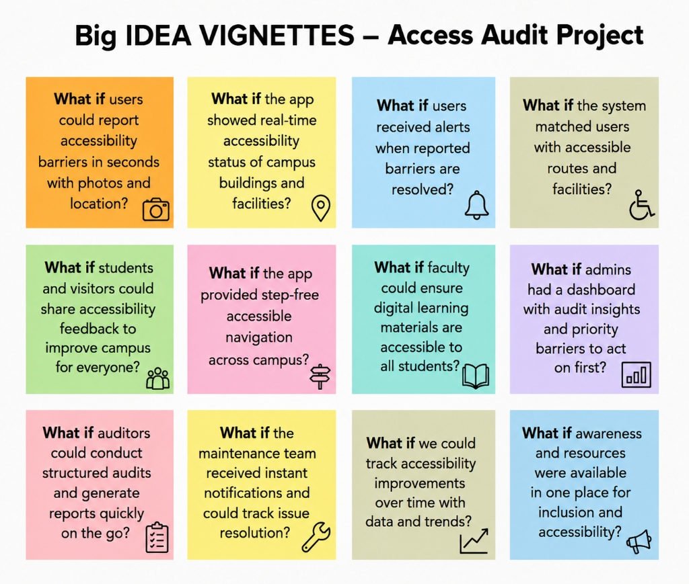
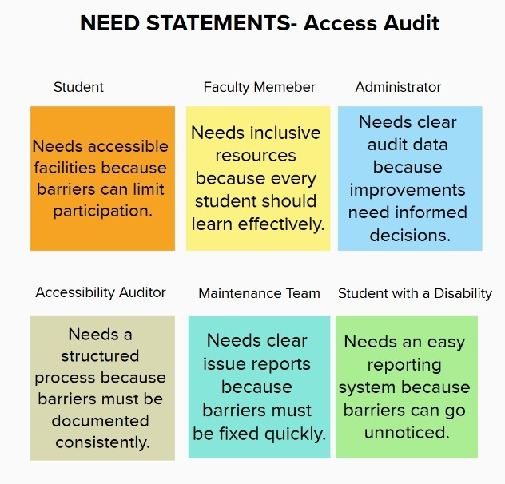
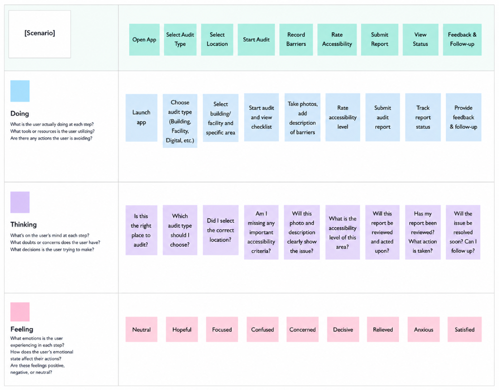
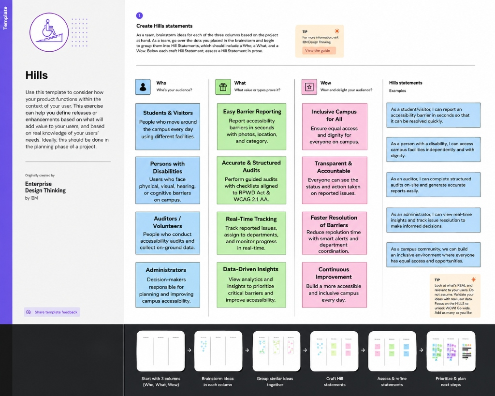
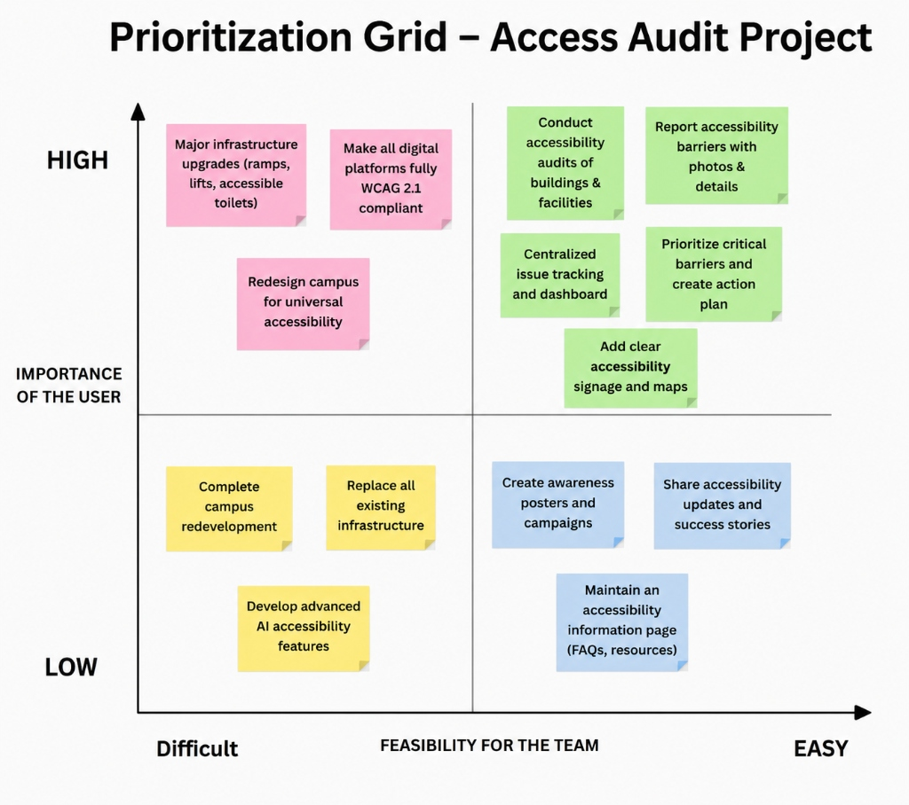

# AccessAudit — Final Technical Report

> **Project:** S-06: Accessibility Audit & Inclusion Improvement Drive on Campus
> **Platform:** AccessAudit — Open-Source Campus Accessibility Audit & Compliance Management System
> **Author:** Vaibhav Tiwari
> **Institution:** Chandigarh University — CUSOC Social Innovation Initiative
> **Version:** 1.0 | **Date:** August 2026

---

## 1. Executive Summary

AccessAudit is an open-source, full-stack web application designed to systematically evaluate, document, and improve physical and digital accessibility across university campuses. The platform enables structured audits benchmarked against the **Rights of Persons with Disabilities (RPWD) Act, 2016** and **Web Content Accessibility Guidelines (WCAG) 2.1 Level AA**, while facilitating participatory feedback from students and staff with disabilities.

The system serves five distinct user roles — **Administrator, Auditor, Student, Maintenance, and University Administration** — each with tailored dashboards, workflows, and reporting capabilities. Through evidence-based scoring, prioritized remediation roadmaps, and awareness campaign tools, AccessAudit transforms campus accessibility from a compliance checkbox into a data-driven, participatory improvement process.

**Key Achievements:**
- 18 feature-complete frontend pages with responsive design
- 29 React components (16 feature + 13 UI library)
- 12 REST API controller endpoints with full CRUD operations
- Role-Based Access Control (RBAC) across 4 user roles
- Automated CI/CD pipeline via GitHub Actions
- Comprehensive accessibility toolkit (high contrast, dyslexia font, TTS, screen reader verbal map, reduced motion)

---

## 2. Problem Statement

People with disabilities — including those with mobility, visual, and hearing impairments — face persistent barriers in university campus infrastructure, digital resources, and classroom environments. Despite the legal mandate of the RPWD Act 2016, most institutions lack:

1. **Structured audit frameworks** — No standardized method for evaluating campus accessibility
2. **Evidence collection systems** — No centralized platform for documenting barriers with photographic evidence
3. **Compliance benchmarking** — No automated scoring against RPWD and WCAG standards
4. **Participatory mechanisms** — Limited involvement of students with disabilities in the improvement process
5. **Data-driven remediation** — No prioritized, trackable roadmap for accessibility improvements

AccessAudit addresses each of these gaps through a purpose-built digital platform.

### Big Idea Vignettes

The following "What If" vignettes capture the core design thinking questions that drove the platform's feature development:



Each vignette maps directly to a feature implemented in the platform — from barrier reporting and real-time building status to structured audits, accessible navigation, and administrative dashboards.

### Stakeholder Need Statements

Each stakeholder group was analyzed to define their core needs, ensuring the platform addresses real requirements:



These need statements directly informed the system's role-based architecture — with dedicated dashboards, workflows, and permissions tailored to each stakeholder group.

### User Journey Map

The audit workflow was mapped across three dimensions — **Doing**, **Thinking**, and **Feeling** — to understand the complete user experience from app launch through feedback and follow-up:



This empathy mapping ensured each step of the audit workflow (Open App → Select Audit Type → Select Location → Start Audit → Record Barriers → Rate Accessibility → Submit Report → View Status → Feedback) was designed to minimize user confusion and maximize confidence.

### Hills Statements (IBM Enterprise Design Thinking)

Using the **Who / What / Wow** framework, Hills Statements were crafted to define measurable outcomes for each stakeholder group:



The Hills framework ensured every feature delivers tangible value — connecting *who* benefits (students, persons with disabilities, auditors, administrators) with *what* the platform provides (barrier reporting, structured audits, real-time tracking, data-driven insights) and *wow* outcomes (inclusive campus, transparent accountability, faster resolution, continuous improvement).

---

## 3. System Architecture

### 3.1 High-Level Architecture

The system follows a **three-tier architecture** pattern:

```
┌─────────────────────────────────────────────┐
│              Presentation Tier              │
│    React 18 + Vite + CSS Design System      │
│    (SPA with Client-Side Routing)           │
├─────────────────────────────────────────────┤
│               Application Tier              │
│    Spring Boot 3.4.1 (Java 21)              │
│    REST API + JWT Auth + Spring Security    │
├─────────────────────────────────────────────┤
│                 Data Tier                   │
│    PostgreSQL 16 + Spring Data JPA          │
│    (Hibernate ORM with Auto-DDL)            │
└─────────────────────────────────────────────┘
```

### 3.2 Technology Stack Justification

| Layer | Technology | Rationale |
|-------|-----------|-----------|
| Frontend | React 18 + Vite | Component-based UI with fast HMR; ideal for complex multi-role dashboards |
| Styling | Vanilla CSS + Design Tokens | Maximum control over accessibility features (high contrast, dyslexia mode) |
| Backend | Spring Boot 3.4.1 | Enterprise-grade security, JPA integration, and extensive ecosystem |
| Auth | JWT + BCrypt | Stateless authentication suitable for REST APIs; secure password storage |
| Database | PostgreSQL 16 | ACID compliance, JSON support, robust query optimizer |
| Containerization | Docker Compose | Reproducible deployment across environments |
| CI/CD | GitHub Actions | Automated testing and build verification on every push |
| Maps | Leaflet.js | Open-source, lightweight, accessible interactive mapping |
| Charts | Recharts | React-native charting library with good accessibility support |
| PDF Export | OpenPDF | Open-source PDF generation for compliance reports |

### 3.3 Component Architecture

```
frontend/
├── src/
│   ├── components/           # 29 reusable components
│   │   ├── ui/               # 13 design system primitives
│   │   │   ├── Button.jsx, Card.jsx, Modal.jsx, Badge.jsx
│   │   │   ├── Input.jsx, Select.jsx, Tabs.jsx, Alert.jsx
│   │   │   ├── Progress.jsx, Tooltip.jsx, Skeleton.jsx
│   │   │   ├── Avatar.jsx, ErrorBoundary.jsx
│   │   └── [16 feature components]
│   ├── pages/                # 18 route-level pages
│   ├── context/              # React context providers
│   ├── services/             # API integration layer
│   └── styles/               # CSS design system
│
backend/
├── src/main/java/com/cusoc/accessaudit/
│   ├── controller/           # 12 REST controllers
│   ├── service/              # Service interfaces
│   │   └── impl/             # Service implementations
│   ├── repository/           # JPA repositories
│   ├── model/                # JPA entity models
│   ├── dto/                  # Data transfer objects
│   ├── mapper/               # Entity-DTO mappers
│   ├── security/             # JWT + Spring Security
│   ├── config/               # Application configs
│   └── exception/            # Global exception handler
```

---

## 4. Feature Implementation Details

### 4.1 Accessibility Audit Engine

The core audit workflow follows a structured pipeline:

1. **Building Registration** — Admin registers campus buildings with metadata (floors, location, building code)
2. **Audit Creation** — Auditor selects a building and initiates an audit
3. **Checklist Evaluation** — Standardized checklist items mapped to RPWD Act 2016 and WCAG 2.1 criteria
4. **Scoring** — Each item scored 0–10; overall compliance percentage calculated automatically:

$$\text{Compliance Score (\%)} = \left(\frac{\sum \text{Earned Scores}}{\sum \text{Maximum Possible Scores}}\right) \times 100$$

5. **Evidence Upload** — Photographic evidence attached to audit findings
6. **Submission & Review** — Audits submitted for administrative review and approval

### 4.2 Barrier Issue Reporting System

Students can report accessibility barriers through a moderated submission system:

- **Location Intelligence** — Auto-parses floor and area type from location descriptions
- **Duplicate Detection** — Keyword-matching algorithm prevents duplicate reports for the same building/floor/area
- **Content Moderation** — Real-time profanity filter with leetspeak normalization (e.g., `@` → `a`, `$` → `s`, `3` → `e`)
- **Community Upvoting** — Students upvote reported issues to signal priority

### 4.3 Remediation Roadmap (Kanban)

A visual Kanban board tracks remediation tasks through three stages:
- **To Do** → **In Progress** → **Complete**

Tasks include priority levels (Critical, High, Medium, Low), category tagging (Physical, Digital, Signage), and assignment tracking.

### 4.4 Accessibility Toolkit

The platform itself implements accessibility features:

| Feature | Implementation |
|---------|---------------|
| High Contrast Mode | CSS custom properties swap to WCAG AAA contrast ratios |
| Dyslexia-Friendly Font | OpenDyslexic font toggle via CSS font-family override |
| Text-to-Speech | Web Speech Synthesis API integration |
| Reduced Motion | `prefers-reduced-motion` media query respect + manual toggle |
| Dynamic Font Scaling | CSS `rem`-based sizing with user-adjustable root font size |
| Color Blind Themes | Deuteranopia/Protanopia-safe palette alternatives |
| Keyboard Navigation | Full `tabindex` management, focus rings, skip-to-content links |
| Screen Reader Verbal Map | Text-based building directory with TTS narration |

### 4.5 Interactive Campus Map

Built with Leaflet.js, the interactive map provides:
- Building markers with accessibility scores
- Filter toggles for ramps, elevators, accessible washrooms, and parking
- Wheelchair-accessible path overlay
- Click-to-audit direct navigation

### 4.6 Reporting & Analytics

- **Dashboard Analytics** — Role-specific scorecards with compliance trends (Recharts)
- **PDF Export** — Comprehensive audit reports generated via OpenPDF
- **Compliance Trends** — Historical accessibility score tracking
- **Department Comparison** — Side-by-side building accessibility comparisons
- **Inclusion Leaderboard** — Ranks buildings by accessibility scores

### 4.7 Community Engagement

- **Pilot Improvement Proposals** — Students propose low-cost accessibility improvements
- **Awareness Campaigns** — Track campus awareness events and reach
- **Feedback Sessions** — Document participatory feedback from students with disabilities
- **Disability Ally Network** — Volunteer registration and directory
- **Accessibility Quiz** — Interactive quiz for campus awareness building

---

## 5. Security Architecture

### 5.1 Authentication & Authorization

| Mechanism | Implementation |
|-----------|---------------|
| Password Storage | BCrypt hashing with configurable strength factor |
| Session Management | Stateless JWT tokens with configurable expiration |
| Role-Based Access | Spring Security `@PreAuthorize` annotations on controllers |
| CORS Policy | Configurable origin whitelist via `WebSecurityConfig` |

### 5.2 Data Protection

- **SQL Injection Prevention** — All database queries parameterized via Spring Data JPA/Hibernate ORM
- **Input Validation** — Bean Validation (`@Valid`, `@NotBlank`, `@Email`) on all DTOs
- **Content Moderation** — Client-side real-time profanity filter with leetspeak normalization
- **XSS Prevention** — React's built-in JSX escaping prevents cross-site scripting

---

## 6. Testing Strategy

### 6.1 Backend Testing

| Test Type | Framework | Coverage |
|-----------|-----------|----------|
| Unit Tests | JUnit 5 + Mockito | Service layer business logic |
| Integration Tests | Spring Boot Test + H2 | Controller-to-database flows |
| Security Tests | Spring Security Test | JWT validation, RBAC enforcement |

- **Test Database:** H2 in-memory with PostgreSQL compatibility mode
- **Test Profile:** `application-test.properties` with `@ActiveProfiles("test")`
- **Results:** 8/8 tests passing, 0 failures

### 6.2 Frontend Verification

| Area | Method |
|------|--------|
| Build Integrity | `npm run build` — zero compilation errors |
| Responsive Layout | Manual viewport testing (320px–1920px) |
| Accessibility | Keyboard navigation, screen reader, ARIA compliance |
| Cross-Browser | Chrome, Firefox, Edge verified |

### 6.3 CI/CD Pipeline

GitHub Actions workflow (`.github/workflows/ci.yml`) automates:
1. **Backend**: JDK 21 setup → Maven test → Maven package
2. **Frontend**: Node 20 setup → npm ci → npm run build

---

## 7. Standards Compliance

### 7.1 RPWD Act 2016 Alignment

The audit checklist categories directly map to RPWD Act 2016 requirements:
- Ramp accessibility and gradient compliance
- Elevator availability and tactile controls
- Accessible washroom specifications
- Tactile pathway presence
- Signage and wayfinding standards
- Emergency evacuation accessibility

### 7.2 WCAG 2.1 Level AA Compliance

Digital accessibility evaluations follow WCAG 2.1 principles:
- **Perceivable** — Text alternatives, captions, color contrast
- **Operable** — Keyboard accessibility, timing, navigation
- **Understandable** — Readable content, predictable interfaces
- **Robust** — Compatible with assistive technologies

---

## 8. Challenges & Solutions

| Challenge | Solution |
|-----------|----------|
| Cross-platform CI/CD compatibility | Replaced Maven wrapper (`mvnw`) with system Maven in GitHub Actions to avoid CRLF/path issues |
| Real-time profanity filter bypasses | Implemented leetspeak normalization matrix and symbol stripping before dictionary matching |
| Duplicate barrier report prevention | Built keyword-matching algorithm with floor/area/building deduplication logic |
| Accessibility of the platform itself | Implemented 8 distinct accessibility modes (high contrast, dyslexia font, TTS, etc.) |
| Large codebase maintainability | Comprehensive JSDoc/JavaDoc across all 111 Java source files and 18 React pages |

---

## 9. Project Statistics

| Metric | Value |
|--------|-------|
| Total Git Commits | 483+ |
| Frontend Pages | 18 |
| React Components | 29 (16 feature + 13 UI) |
| Backend Controllers | 12 |
| Java Source Files | 111 |
| JUnit Test Cases | 8 |
| Documentation Files | 15+ |
| Lines of Code (Frontend) | ~15,000+ |
| Lines of Code (Backend) | ~8,000+ |

---

## 10. Prioritization Strategy

To guide remediation decisions, a **Prioritization Grid** was developed mapping each improvement initiative against two dimensions: **Importance to the User** (vertical axis) and **Feasibility for the Team** (horizontal axis).



**Key takeaways from the grid:**
- **Do First (High Impact, High Feasibility):** Conduct accessibility audits, report barriers with evidence, centralized issue tracking, prioritize critical barriers with action plans
- **Plan Strategically (High Impact, Low Feasibility):** Major infrastructure upgrades (ramps, lifts, toilets), full WCAG 2.1 digital compliance, universal campus redesign
- **Quick Wins (Low Impact, High Feasibility):** Awareness campaigns, success stories, accessibility information pages
- **Defer (Low Impact, Low Feasibility):** Complete campus redevelopment, replace all infrastructure, advanced AI features

This grid directly informed our platform's feature prioritization — focusing first on audit tools, barrier reporting, and issue tracking (top-right quadrant) before addressing infrastructure-level changes.

---

## 11. Future Scope

1. **Mobile Application** — React Native companion for field auditors
2. **Offline Sync** — Service worker-based offline audit capability
3. **AI-Assisted Analysis** — Computer vision for automated accessibility assessment from photos
4. **Multi-Campus Support** — Tenant-based architecture for deploying across institutions
5. **Public Dashboard** — Open data portal for transparency and accountability
6. **GIS Integration** — Advanced geospatial mapping with accessibility heatmaps

---

## 12. Conclusion

AccessAudit demonstrates that campus accessibility improvement can be systematically approached through technology. By combining structured audit workflows, participatory feedback mechanisms, evidence-based scoring, and data-driven remediation planning, the platform provides university administrators with actionable insights to create more inclusive campuses.

The project successfully addresses all six objectives outlined in the CUSOC S-06 challenge:
1. ✅ Comprehensive accessibility audit of campus infrastructure and digital assets
2. ✅ Benchmarking against RPWD Act 2016 and WCAG 2.1 standards
3. ✅ Prioritized remediation roadmap for administration
4. ✅ Participatory feedback from students with disabilities
5. ✅ Awareness campaign tools for inclusive campus culture
6. ✅ Pilot low-cost accessibility improvement proposals with community engagement

---

## References

1. Rights of Persons with Disabilities Act, 2016 — Government of India
2. Web Content Accessibility Guidelines (WCAG) 2.1 — W3C Recommendation
3. Universal Design Principles — Centre for Universal Design, NC State University
4. Spring Boot Reference Documentation — VMware/Pivotal
5. React Documentation — Meta Platforms
