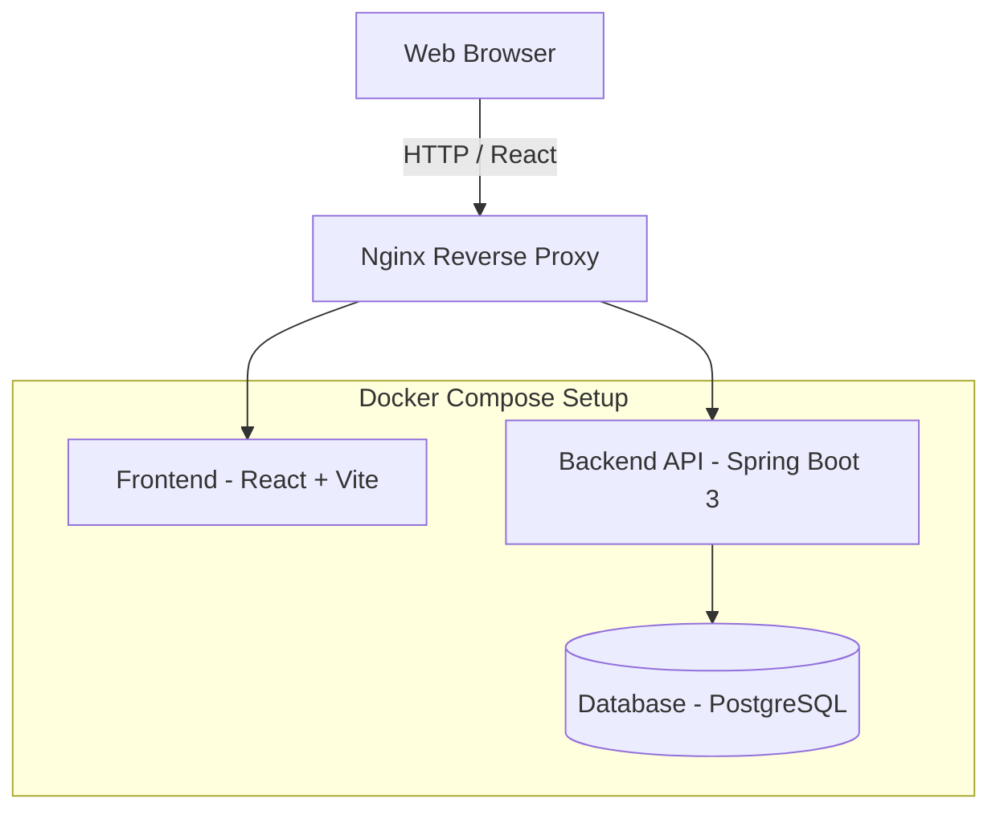

# Architecture Diagram

The Access Audit platform uses a standard multi-tier micro-architecture orchestrated by Docker Compose.

## Components
1. **Frontend**: React 18, Vite, Tailwind CSS v4, React Router v6.
2. **Backend**: Java 21, Spring Boot 3, Spring Security (JWT), Spring Data JPA.
3. **Database**: PostgreSQL 16 database storing relational entities.
4. **Nginx**: Static file server and proxy for the frontend.
