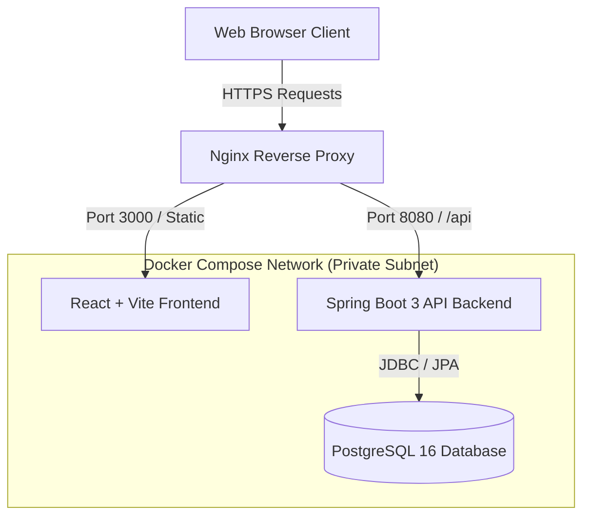

# 🏗️ System Architecture & Diagram

The Access Audit platform utilizes a containerized multi-tier micro-services architecture orchestrated by Docker Compose.

---

## 1. System Topology Diagram

```mermaid
graph TD
    Client[Web Browser Client] -->|HTTPS Requests| Proxy[Nginx Reverse Proxy]
    Proxy -->|Port 3000 / Static| Frontend[React + Vite Frontend]
    Proxy -->|Port 8080 / /api| Backend[Spring Boot 3 API Backend]
    Backend -->|JDBC / JPA| DB[(PostgreSQL 16 Database)]
    
    subgraph "Docker Compose Network (Private Subnet)"
        Frontend
        Backend
        DB
    end
```

---

## 2. Component Descriptions

### A. Reverse Proxy (Nginx)
*   **Role**: Entrypoint reverse proxy.
*   **Actions**:
    *   Serves compiled production React static assets from directories directly.
    *   Proxies all incoming `/api` endpoint requests to port `8080` backend containers dynamically.
    *   Enforces secure CORS headers and rate-limiting limits.

### B. Client Application (React + Vite)
*   **Role**: User interface and state machine.
*   **Key Libraries**:
    *   **Leaflet.js & React-Leaflet**: Geospatial rendering of accessibility markers.
    *   **Framer Motion**: Smooth canvas transitions and accordion expanders.
    *   **React Router v6**: Dynamic path routing, layout wrappers, and Role-Based Access controls.

### C. Application Server (Spring Boot 3)
*   **Role**: Core business logic and transaction management.
*   **Security Layers**:
    *   **Spring Security Integration**: Intercepts requests using custom authentication filters (`OncePerRequestFilter`).
    *   **JWT Token Processor**: Encodes/decodes base64 signatures containing role claims and scopes.
    *   **PreAuthorize Interceptors**: Secures controller endpoints at method levels.

### D. Relational Database (PostgreSQL 16)
*   **Role**: Data store for audit compliance results, building registers, student issue reports, and maintenance task schedules.
