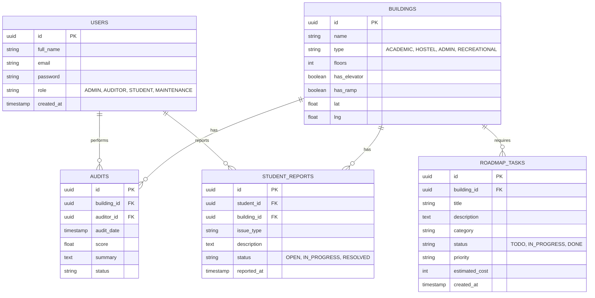

# Database Schema

The system uses PostgreSQL for persistence. The database schema relies heavily on relational mapping provided by Spring Data JPA.

```mermaid
erDiagram
    USERS {
        uuid id PK
        string full_name
        string email
        string password
        string role "ADMIN, AUDITOR, STUDENT, MAINTENANCE"
        timestamp created_at
    }
    
    BUILDINGS {
        uuid id PK
        string name
        string type "ACADEMIC, HOSTEL, ADMIN, RECREATIONAL"
        int floors
        boolean has_elevator
        boolean has_ramp
        float lat
        float lng
    }
    
    AUDITS {
        uuid id PK
        uuid building_id FK
        uuid auditor_id FK
        timestamp audit_date
        float score
        text summary
        string status
    }
    
    STUDENT_REPORTS {
        uuid id PK
        uuid student_id FK
        uuid building_id FK
        string issue_type
        text description
        string status "OPEN, IN_PROGRESS, RESOLVED"
        timestamp reported_at
    }
    
    ROADMAP_TASKS {
        uuid id PK
        uuid building_id FK
        string title
        text description
        string category
        string status "TODO, IN_PROGRESS, DONE"
        string priority
        int estimated_cost
        timestamp created_at
    }

    USERS ||--o{ AUDITS : "performs"
    USERS ||--o{ STUDENT_REPORTS : "reports"
    BUILDINGS ||--o{ AUDITS : "has"
    BUILDINGS ||--o{ STUDENT_REPORTS : "has"
    BUILDINGS ||--o{ ROADMAP_TASKS : "requires"
```
