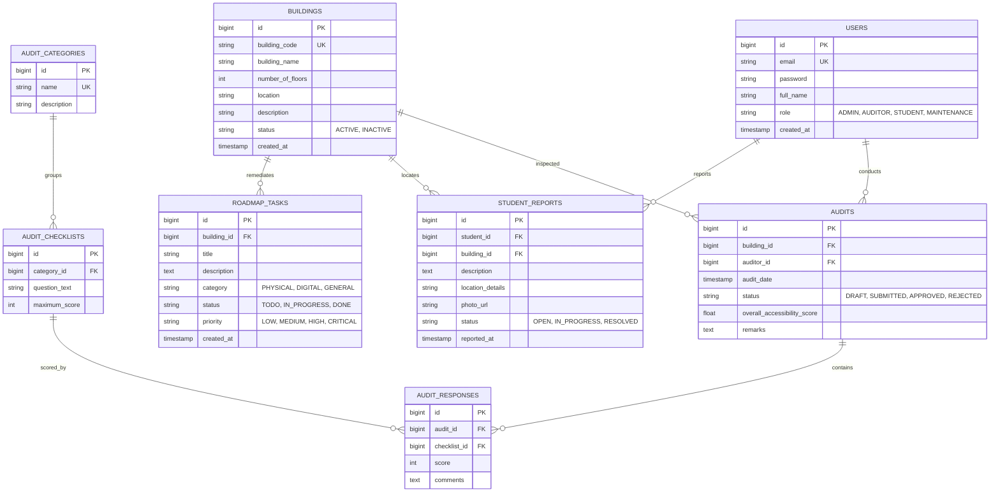

# 🗄️ Database Entity Schema Design

The Access Audit platform uses PostgreSQL as its primary transactional database. The schema design is managed via Spring Data JPA mappings.

---

## 1. Entity Relationship (ER) Diagram

---

## 2. Table Schemas & Fields Details

### A. USERS Table
*   `id` (BIGINT, Primary Key, Auto-increment)
*   `email` (VARCHAR(150), Unique Constraint, Not Null)
*   `password` (VARCHAR(255), BCrypt Hashed, Not Null)
*   `full_name` (VARCHAR(100), Not Null)
*   `role` (VARCHAR(50), Constraint: `ADMIN`, `AUDITOR`, `STUDENT`, `MAINTENANCE`)
*   `created_at` (TIMESTAMP, Default: current_timestamp)

### B. BUILDINGS Table
*   `id` (BIGINT, Primary Key, Auto-increment)
*   `building_code` (VARCHAR(50), Unique Constraint, Not Null)
*   `building_name` (VARCHAR(100), Not Null)
*   `number_of_floors` (INT, Not Null)
*   `location` (VARCHAR(255))
*   `description` (TEXT)
*   `status` (VARCHAR(20), Default: `'ACTIVE'`)
*   `created_at` (TIMESTAMP, Default: current_timestamp)

### C. AUDITS Table
*   `id` (BIGINT, Primary Key, Auto-increment)
*   `building_id` (BIGINT, Foreign Key referencing `BUILDINGS(id)`, Not Null)
*   `auditor_id` (BIGINT, Foreign Key referencing `USERS(id)`, Not Null)
*   `audit_date` (TIMESTAMP, Not Null)
*   `status` (VARCHAR(30), Default: `'DRAFT'`)
*   `overall_accessibility_score` (DOUBLE PRECISION)
*   `remarks` (TEXT)

### D. AUDIT_RESPONSES Table
*   `id` (BIGINT, Primary Key, Auto-increment)
*   `audit_id` (BIGINT, Foreign Key referencing `AUDITS(id)`, Cascaded Delete)
*   `checklist_id` (BIGINT, Foreign Key referencing `AUDIT_CHECKLISTS(id)`)
*   `score` (INT, Constraint: `0` to max checklist possible score)
*   `comments` (TEXT)
