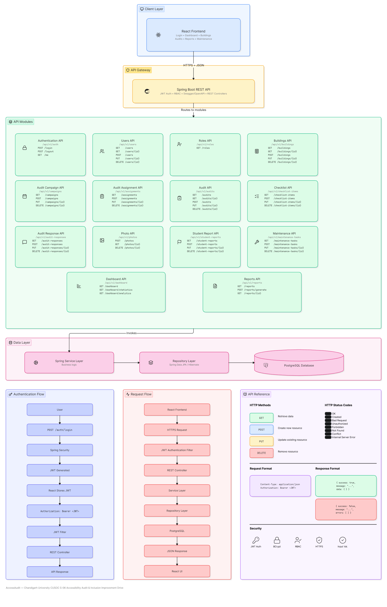

# API Design

## Overview

AccessAudit follows a RESTful API architecture that enables communication between the frontend application and the backend services.

The API allows users to perform accessibility audits, manage buildings, submit reports, upload evidence, and monitor remediation activities through standardized HTTP requests.

---

# API Architecture Diagram



---

# API Design Objectives

The API is designed to:

- Provide secure communication between frontend and backend.
- Support CRUD operations for all system modules.
- Enable structured accessibility data collection.
- Ensure modular and scalable backend services.
- Return consistent and predictable responses.

---

# API Architecture

The frontend communicates with the Spring Boot backend using REST APIs.

The backend processes requests, performs business logic, interacts with the PostgreSQL database, and returns JSON responses.

---

# Main API Modules

| Module | Purpose |
|----------|---------|
| Authentication API | User authentication and authorization |
| User API | User management |
| Building API | Building information management |
| Audit API | Accessibility audit management |
| Checklist API | Accessibility checklist management |
| Evidence API | Photo evidence upload |
| Student Report API | Student accessibility reporting |
| Maintenance API | Maintenance task management |
| Dashboard API | Analytics and reporting |

---

# HTTP Methods

| Method | Purpose |
|----------|---------|
| GET | Retrieve data |
| POST | Create new records |
| PUT | Update existing records |
| DELETE | Remove records |

---

# Response Format

All API responses use JSON.

Example:

```json
{
  "status": "success",
  "message": "Audit submitted successfully",
  "data": {}
}
```

---

# Security

The API uses:

- JWT Authentication
- Role-Based Access Control (RBAC)
- Password Encryption using BCrypt
- HTTPS communication

---

# Error Handling

The API returns standard HTTP status codes.

| Code | Meaning |
|------|----------|
| 200 | Success |
| 201 | Created |
| 400 | Bad Request |
| 401 | Unauthorized |
| 403 | Forbidden |
| 404 | Not Found |
| 500 | Internal Server Error |

---

# Design Principles

The API follows:

- REST Architecture
- Stateless Communication
- Resource-Based Endpoints
- JSON Data Exchange
- Modular Service Design

---

# Alignment with CUSOC Objectives

The API enables the software platform to support:

- Accessibility audits
- Student accessibility reporting
- Evidence collection
- Remediation tracking
- Administrative reporting

The API serves as the communication layer that connects users with the accessibility management system while supporting the objectives of the CUSOC S-06 challenge.