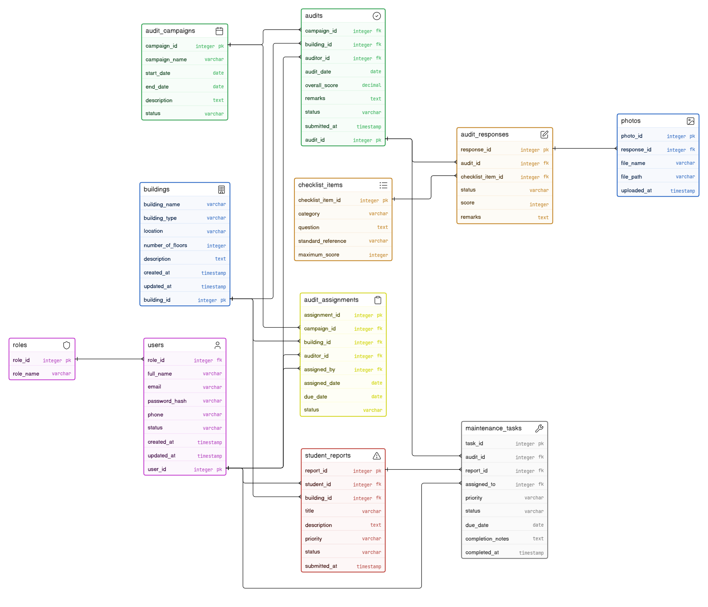

# Database Design

## Overview

AccessAudit uses a relational database to store accessibility audit information, user data, audit findings, student reports, and maintenance activities.

The database is designed using normalization principles to minimize data redundancy while maintaining data integrity and efficient querying.

---

# Database Design Diagram

---

# Design Objectives

The database is designed to:

- Store campus building information.
- Manage user accounts and roles.
- Record accessibility audits.
- Store checklist responses and audit evidence.
- Track student accessibility reports.
- Manage maintenance tasks.
- Support report generation and analytics.

---

# Core Entities

| Entity | Description |
|----------|-------------|
| User | Stores system users and their roles. |
| Building | Stores campus building information. |
| Audit | Stores accessibility audit records. |
| Checklist Item | Stores accessibility checklist criteria. |
| Audit Response | Stores responses for each checklist item. |
| Evidence | Stores photo evidence uploaded during audits. |
| Student Report | Stores accessibility issues reported by students. |
| Maintenance Task | Stores remediation tasks assigned after audits. |

---

# Relationships

- One User can conduct multiple Audits.
- One Building can have multiple Audits.
- One Audit contains multiple Audit Responses.
- One Checklist Item can appear in multiple Audit Responses.
- One Audit can have multiple Evidence records.
- One Student can submit multiple Student Reports.
- One Student Report may generate one Maintenance Task.
- One Audit may generate multiple Maintenance Tasks.

---

# Database Design Principles

The database follows:

- Relational Database Model
- Third Normal Form (3NF)
- Primary and Foreign Key Relationships
- Referential Integrity
- Minimal Data Redundancy

---

# Database Management System

| Component | Technology |
|------------|------------|
| Database | PostgreSQL |
| ORM | Spring Data JPA / Hibernate |

---

# Alignment with CUSOC Objectives

The database structure supports the collection and management of:

- Physical accessibility audit records
- Digital accessibility audit records
- Student feedback
- Audit evidence
- Remediation activities
- Administrative reporting

The design ensures that all accessibility data collected during the project can be securely stored, managed, and retrieved for analysis and reporting.