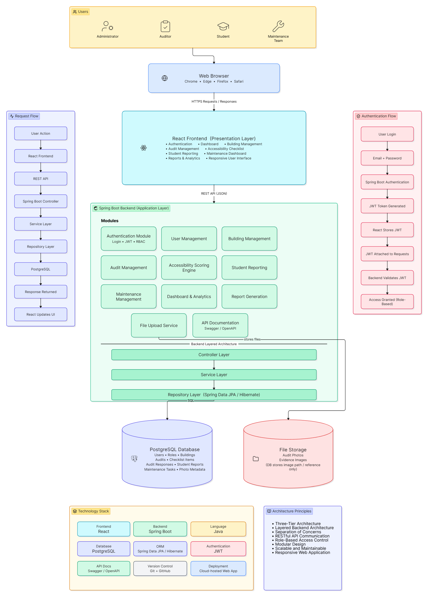

# System Architecture

## Overview

AccessAudit is an open-source web application developed for the **CUSOC S-06: Accessibility Audit & Inclusion Improvement Drive on Campus** challenge.

The system provides a centralized platform for conducting and managing accessibility audits of **physical campus infrastructure** and **digital assets**. It enables auditors to record accessibility findings, upload evidence, generate remediation reports, and support university administration in improving campus accessibility.

The application follows a **Three-Tier Architecture**, separating the presentation layer, business logic, and data layer to ensure modularity, maintainability, and scalability.

---

# Architecture Objectives

The system architecture is designed to:

- Support structured accessibility audits.
- Centralize audit data management.
- Store accessibility findings and photographic evidence.
- Track remediation activities.
- Support participatory student reporting.
- Generate reports for university administration.
- Maintain a modular and scalable software structure.

---

# High-Level System Architecture

The architecture consists of three primary layers:

| Layer | Responsibility |
|--------|----------------|
| Presentation Layer | Provides the user interface for administrators, auditors, students, and maintenance staff. |
| Application Layer | Processes business logic, manages accessibility audits, reporting, and system operations. |
| Data Layer | Stores users, buildings, audit records, checklist responses, reports, and maintenance data. |

The frontend communicates with the backend through REST APIs, while the backend interacts with the PostgreSQL database to store and retrieve application data.

---

# Architecture Components

## Presentation Layer

The Presentation Layer provides the graphical user interface through which users interact with the system.

Primary users include:

- Administrator
- Auditor
- Student
- Maintenance Team

Responsibilities include:

- Display dashboards
- Manage accessibility audits
- Submit accessibility reports
- View remediation status
- Generate reports

---

## Application Layer

The Application Layer contains the core business logic of AccessAudit.

Responsibilities include:

- User management
- Building management
- Accessibility audit management
- Checklist processing
- Accessibility scoring
- Student issue reporting
- Maintenance task management
- Report generation

This layer acts as the bridge between the user interface and the database.

---

## Data Layer

The Data Layer manages persistent storage for the application.

It stores:

- User information
- Buildings
- Audit campaigns
- Audit assignments
- Accessibility audits
- Checklist items
- Audit responses
- Photo evidence
- Student reports
- Maintenance tasks

PostgreSQL serves as the relational database management system for the project.

---

# Technology Stack

| Layer | Technology |
|--------|------------|
| Frontend | React |
| Backend | Spring Boot |
| Programming Language | Java |
| Database | PostgreSQL |
| ORM | Spring Data JPA / Hibernate |
| Version Control | Git & GitHub |
| Documentation | Markdown |

---

# Architectural Principles

The system is designed according to the following software engineering principles:

- Three-Tier Architecture
- Layered Software Design
- Separation of Concerns
- Modular Development
- Reusability
- Scalability
- Maintainability
- REST-based Communication
- Open-Source Development

---

# Alignment with CUSOC Objectives

The system architecture has been designed to support the objectives of the **CUSOC S-06 Accessibility Audit & Inclusion Improvement Drive on Campus** challenge by enabling:

- Accessibility audits of physical campus infrastructure.
- Accessibility audits of digital resources.
- Collection of audit evidence.
- Participatory reporting of accessibility barriers.
- Generation of remediation reports.
- Administrative decision support through structured audit data.

The software complements the real-world accessibility audit process and serves as a centralized platform for managing accessibility information throughout the project lifecycle.