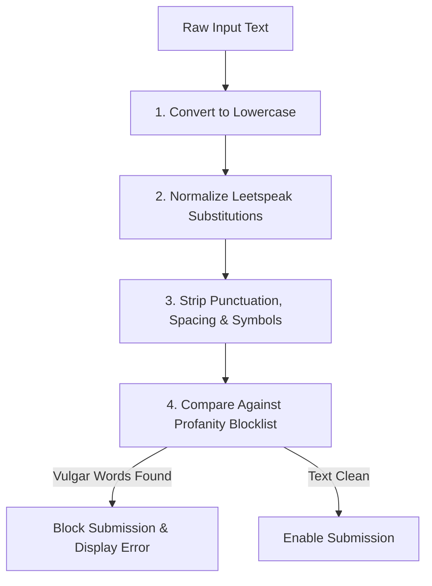

# Input Text Moderation & Profanity Filtering

This document describes the design and implementation of the real-time content moderation engine in the student barrier reporting system.

---

## 🔍 How It Works

The parser processes inputs in real-time on every keypress to prevent students from bypassing validation rules using spaces, leetspeak, or special symbols.

### 1. Conversion and Substitution Matrix
The normalization algorithm translates common leetspeak substitutions to standard characters:

| Leetspeak symbol | Translated Character |
| :---: | :---: |
| `@` | `a` |
| `$` | `s` |
| `1` / `!` | `i` |
| `0` | `o` |
| `3` | `e` |
| `v` / `\` / `/` | `u` / `v` |

### 2. Spacing and Punctuation Stripping
All spaces, punctuation marks, and symbols (e.g. `*`, `.`, `-`, `_`) are completely removed. This ensures bypassing attempts like `f.u.c.k` or `s*h*i*t` are caught.

### 3. Submission Lock
If a matching vulgar keyword is detected:
*   An error message is rendered below the description textbox.
*   The "Submit Report" button is locked.
