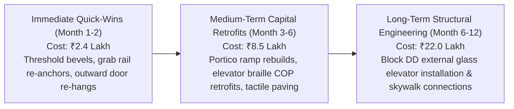

# 🚧 Campus Barrier Taxonomy & Empirical Findings
## Systematic Categorization of 187 Documented Architectural & Environmental Barriers

> **Investigation Lead:** Vaibhav Tiwari  
> **Total Barriers Documented:** 187 Discrete Physical & Environmental Infractions  
> **Data Scope:** 29 Chandigarh University Campus Buildings  
> **Classification Framework:** ISO 21542 / RPWD Act 2016 Severity Matrix  

---

## 📊 Barrier Severity & Domain Distribution

```
Discovered Barriers by Severity Classification (Total = 187)
┌───────────────────────────────────────────────┬────────┬──────────┐
│ Severity Tier                                 │ Count  │ Percent  │
├───────────────────────────────────────────────┼────────┼──────────┤
│ 🔴 Tier 1: Critical (Direct Access Denial)    │   24   │   12.8%  │
│ 🟠 Tier 2: High (Severe Loss of Independence) │   61   │   32.6%  │
│ 🟡 Tier 3: Medium (Sub-Optimal Standard)      │   73   │   39.0%  │
│ 🟢 Tier 4: Low (Minor Maintenance / Signage)  │   29   │   15.5%  │
└───────────────────────────────────────────────┴────────┴──────────┘
```

```
Discovered Barriers by Architectural Domain
┌───────────────────────────────────────────────┬────────┬──────────┐
│ Architectural Category                        │ Count  │ Percent  │
├───────────────────────────────────────────────┼────────┼──────────┤
│ 1. Vertical Circulation (Lifts & Stairs)      │   44   │   23.5%  │
│ 2. Entrances, Ramps & Thresholds              │   39   │   20.9%  │
│ 3. Restrooms & Sanitary Facilities            │   38   │   20.3%  │
│ 4. Signage, Tactile Paving & Wayfinding       │   32   │   17.1%  │
│ 5. Emergency Egress & Life Safety             │   19   │   10.2%  │
│ 6. Classrooms, Labs & Furniture               │   15   │    8.0%  │
└───────────────────────────────────────────────┴────────┴──────────┘
```

---

## 🔴 Tier 1: Critical Barriers (24 Documented Cases)

Critical barriers represent absolute physical blockades where a student or faculty member using a wheelchair or mobility aid is completely excluded from accessing a floor, academic program, or life-safety egress route.

### Case 1.1: Complete Vertical Exclusion in East Campus Block DD (DD1 & DD2)
* **Location:** DD Block Wings 1 & 2, East Campus
* **Defect:** 3-storey instructional complex completely devoid of any elevator, platform lift, or mechanical vertical transportation. Upper floors house 14 specialized electrical and fluid engineering laboratories.
* **Impact:** Wheelchair-using students enrolled in these courses cannot reach mandatory curriculum lab practicals.
* **Remediation Cost Estimate:** ₹18,00,000 (External prefabricated glass-shaft traction lift).

### Case 1.2: Excessive Portico Ramp Gradients at Zakir Husain Complex
* **Location:** Main Entrance Portico, Zakir A & Zakir B
* **Defect:** Entrance ramp gradient measured at $1:9.4$ ($10.6\%$ slope), exceeding the safe $1:12$ ($8.33\%$) statutory limit by $27\%$. The ramp lacks intermediate resting landings over a $12\text{ m}$ continuous run.
* **Impact:** Tipping hazard for manual wheelchair operators; severe muscle strain causing complete reliance on campus security guards to push chairs up the incline.
* **Remediation Cost Estimate:** ₹1,20,000 (Reconstruction to $1:14$ gradient with $1500\text{ mm}$ intermediate landing).

### Case 1.3: Inward-Swinging Restroom Doors Blocking Wheelchair Egress
* **Location:** Ground Floor Accessible Restroom, Zakir B & B2 Block
* **Defect:** The stall door was installed swinging inwards rather than outwards. Once a wheelchair enters the $1600\text{ mm} \times 1700\text{ mm}$ cubicle, the door leaf hits the footrests, preventing the user from closing the door for privacy or opening it to exit.
* **Impact:** Total loss of dignified and autonomous restroom usage.
* **Remediation Cost Estimate:** ₹15,000 per unit (Rehanging door leaf to swing outwards with lever handle).

---

## 🟠 Tier 2: High Severity Barriers (61 Documented Cases)

High-severity barriers do not completely bar access but impose extreme physical hardship, require undignified manual intervention, or fail to inform users with sensory disabilities.

### Case 2.1: Lack of Braille Indicators and Floor Speech Synthesis in Lifts
* **Location:** Central Passenger Elevators, Blocks D1–D6 & Zakir Complex (12 Lift Cars)
* **Defect:** Car operating panels feature smooth stainless-steel buttons with printed ink numerals rather than raised tactile/braille characters. Furthermore, audio chime/speech synthesizers announcing floor arrival are non-operational.
* **Impact:** Visually impaired students are unable to determine which floor they have arrived at without repeatedly asking fellow passengers for assistance.
* **Remediation Cost Estimate:** ₹35,000 per elevator car (Replacement with tactile braille COP and multilingual speech unit).

### Case 2.2: Lab Door Threshold Vertical Obstructions
* **Location:** Floor 2 & 3 Computer Laboratories, Block NC 2, NC 4 & D4 (18 Doorways)
* **Defect:** Raised aluminium wiring channels or weather seals measuring $28\text{ mm to }38\text{ mm}$ in height run across doorways. Statutory maximum vertical rise is $6\text{ mm}$.
* **Impact:** Small front caster wheels of manual wheelchairs become lodged against the threshold, causing sudden stops and risk of forward ejection.
* **Remediation Cost Estimate:** ₹4,500 per doorway (Machined rubber/aluminium bevelled transition ramp).

### Case 2.3: Non-Compliant Grab Rail Mounting Heights & Inadequate Wall Anchors
* **Location:** Accessible Washroom Stalls, Blocks NC 1, NC 3 & B4 (9 Restrooms)
* **Defect:** Horizontal grab rails mounted at $950\text{ mm}$ (statutory limit: $750\text{–}800\text{ mm}$). Anchoring drywall plugs showed physical loosening when tested with a $500\text{ N}$ pull force.
* **Impact:** PwDs transferring from wheelchair to toilet seat cannot leverage upper body strength at excessive heights and risk structural anchor failure.
* **Remediation Cost Estimate:** ₹8,000 per stall (Re-anchoring into masonry backing plates at compliant $750\text{ mm}$ elevation).

---

## 🟡 Tier 3: Medium Severity Barriers (73 Documented Cases)

Medium-severity barriers represent sub-optimal architectural executions that introduce navigational friction, fatigue, or communication deficiencies.

### Case 3.1: Missing Tactile Warning Paving at Staircases
* **Location:** Staircase Landings, Block C3, NC 5 & D7 (22 Staircases)
* **Defect:** Top landings of interior stairwells lack hazard warning blister tiles ($300\text{ mm}$ depth).
* **Impact:** White cane users cannot detect the impending drop-off of the descending stair flight prior to reaching the first step edge.

### Case 3.2: High Drinking Water Dispensers Without Secondary Low-Level Taps
* **Location:** Corridors across Block D, NC, and Zakir Complexes (26 Stations)
* **Defect:** Water cooler dispense spouts installed at $1050\text{ mm to }1150\text{ mm}$ above finished floor level with deep knee aprons.
* **Impact:** Wheelchair-seated students cannot reach the dispense lever or place a water bottle beneath the nozzle.

### Case 3.3: Excessive Door Opening Force on Fire and Smoke Doors
* **Location:** Internal Fire Separation Doors, Block NC 1–5 & C1–C3 (16 Doors)
* **Defect:** Overhead hydraulic door closers adjusted with heavy spring tensions requiring $45\text{ N to }62\text{ N}$ opening force (statutory maximum: $22.2\text{ N}$).
* **Impact:** Crutch users and individuals with reduced upper-body strength cannot open doors independently while balancing mobility aids.

---

## 🟢 Tier 4: Low Severity Barriers (29 Documented Cases)

Minor maintenance defects, worn paint markings, or sub-optimal contrast levels that can be rapidly resolved through routine facilities maintenance:
* Faded blue-and-white paint on designated accessible parking bays.
* Glossy acrylic signage causing high glare under daylight conditions.
* Loose rubber nosings on two basement service steps.
* Missing signage directing visitors from non-accessible side doors to the main accessible ramp portico.

---

## 🛠️ Prioritized Remediation Roadmap

Based on the empirical findings, remediation has been structured into three operational phases:


