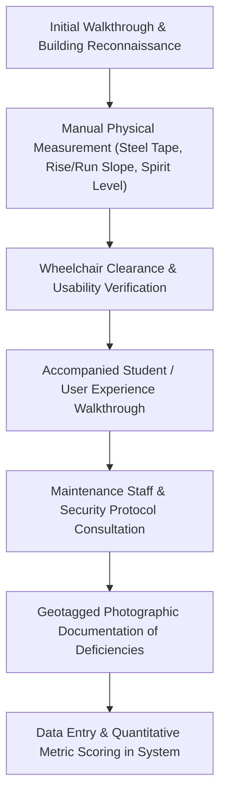

# 🔬 Fieldwork Methodology & Inspection Protocol
## Standardized Physical Measurement & Data Collection Framework

> **Lead Author & Investigator:** Vaibhav Tiwari  
> **Inspection Standard:** 100% In-Situ Physical Verification (Manual Ground Auditing — No Fictional Machines or Theoretical Estimations)  
> **Regulatory Basis:** Rights of Persons with Disabilities (RPWD) Act 2016 (India) | Harmonised Guidelines and Space Standards for Barrier-Free Built Environment 2021 (CPWD/MoUD) | National Building Code of India (NBC 2016) | ISO 21542:2021  

---

## 🛠️ Field Toolkit & Manual Inspection Methods

Every single measurement and assessment throughout the on-foot campus fieldwork was carried out manually and directly on site. No automated laboratory machinery, electronic lasers, or expensive specialized sensors were used. The audit was conducted using standard, accessible, physical measurement tools, direct visual inspection, and structured field tally sheets:

| Inspection Tool | Practical Technique & Specifications | Primary Measurement Application | Statutory RPWD Benchmark |
| :--- | :--- | :--- | :--- |
| **Standard Steel Measuring Tape** | 5m & 30m manual retractable steel measuring tapes | Clear door opening widths, corridor clearance, step riser & tread dimensions, grab rail mounting heights, washroom interior clearances, drinking water spout heights | Doorways $\ge 900\text{ mm}$; Corridors $\ge 1500\text{ mm}$; Step riser $\le 150\text{ mm}$; Grab rails at $750\text{ mm}$ & $900\text{ mm}$ |
| **Manual Rise & Run Slope Calculation** | Spirit level + steel tape measuring vertical rise ($\Delta h$) and horizontal run ($\Delta d$) to compute gradient ($\text{Slope} = \frac{\Delta h}{\Delta d}$) | Exterior ramp slopes, entrance threshold bevels, curb ramps, pathway cross-falls | Maximum $1:12$ ($8.33\%$) for wheelchair ramps ($1:15$ to $1:20$ preferred); cross-fall $\le 1:50$ |
| **Smartphone Camera & Geo-Tagging** | High-resolution mobile camera with localized timestamps and building wing notes | Direct photographic evidence of architectural barriers, broken tactile tiles, missing handrails, step barriers, and contrast issues | High-resolution visual proof for estate maintenance work orders |
| **Standardized Audit Checklist & Clipboard** | Physical printout & digital spreadsheet checklist (42 parameters based on Harmonised Guidelines 2021) | Systematic step-by-step scoring of entrances, corridors, staircases, lifts, toilets, and classrooms | Objective 3-tier scoring rubric (Compliant, Deficient, Non-Compliant) |
| **Physical Navigation & Manual Verification** | On-foot walkthrough, step counting, door handle push/pull testing, tactile surface fingertip/sole checks | Checking door opening stiffness, floor surface slipperiness, tactile guiding continuity, threshold obstructions | Unobstructed route of travel; doors operable with single hand/closed fist |
| **Participatory Student & Staff Consultations** | Student interactions, peer feedback, and accompanied walkthroughs with campus members | Ground-truth user experience validation for students with visual, mobility, and hearing impairments | Section 16 & Section 40 of RPWD Act 2016 |

---

## 📐 The 42-Parameter Evaluation Protocol

Each of the 29 buildings was systematically audited across **8 physical domains** encompassing 42 specific parameters. Every metric was scored according to a strict 3-tier rubric:

* **Score 1.0 (Compliant):** Fully conforms to RPWD Act 2016 and Harmonised Guidelines 2021 dimensions.
* **Score 0.5 (Partial / Deficient):** Feature exists physically but deviates from statutory dimensions (e.g. ramp present but slope is 1:9 instead of 1:12; or elevator present but lacks audio voice annunciator).
* **Score 0.0 (Non-Compliant / Missing):** Feature is absent, inoperable, or presents a direct safety hazard to persons with disabilities.

### Domain 1: Entrances & Approach Paths (RPWD Act §40)
1. **Clear Opening Width:** $\ge 900\text{ mm}$ clear passage measured with steel tape between door face and frame stop.
2. **Step-Free Accessibility:** Level transition or ramped approach connecting exterior grade to interior lobby.
3. **Ramp Gradient Compliance:** Longitudinal slope not exceeding $1:12$ ($8.33\%$) calculated via manual vertical rise over horizontal run.
4. **Dual-Tier Continuous Handrails:** Rigid circular rails measured at $750\text{ mm}$ and $900\text{ mm}$ with $300\text{ mm}$ horizontal end extensions.
5. **Anti-Slip Surfacing:** Textured non-skid surface finish, grooved pavers, or slip-resistant tiles.
6. **Flush Thresholds:** Vertical threshold change not exceeding $6\text{ mm}$ (or $13\text{ mm}$ with $1:2$ bevel).
7. **Door Operating Effort:** Manual door opening resistance check ensuring effortless opening without heavy spring resistance (operable with a closed fist).

### Domain 2: Vertical Circulation (RPWD Act §40, NBC 2016 §4.4)
8. **Elevator Provision:** Functional passenger elevator servicing 100% of accessible levels.
9. **Tactile & Braille Buttons:** High-relief alphanumeric characters ($1\text{ mm}$ relief) with contracted Braille on car operating panels and landing calls.
10. **Audible Speech Synthesizer:** Clear bilingual voice announcement declaring current floor and direction of travel.
11. **Cabin Spatial Dimensions:** Interior dimensions $\ge 1100\text{ mm} \times 1400\text{ mm}$ with rear wall viewing mirror.
12. **Staircase Handrails:** Unbroken handrails flanking both sides of all internal and external stairwells.
13. **Tactile Landing Warnings:** Blister tactile ground surface indicators ($300\text{ mm}$ depth) set $300\text{ mm}$ prior to stair nosings.

### Domain 3: Internal Circulation & Corridors (NBC 2016 §4.2)
14. **Corridor Clear Width:** Minimum unobstructed width $\ge 1500\text{ mm}$ allowing simultaneous two-way traffic.
15. **Turning Clearances:** Level $1500\text{ mm} \times 1500\text{ mm}$ turning spaces spaced at intervals not exceeding $30\text{ metres}$.
16. **Protrusion Limits:** Wall-mounted fixtures protruding $> 100\text{ mm}$ must be detectible below $675\text{ mm}$ height.
17. **Flooring Integrity:** Firm, stable, slip-resistant finish without deep-pile carpets or uneven pavers.

### Domain 4: Signage & Wayfinding (RPWD Act §42, WCAG 2.1)
18. **Tactile Door Signage:** Room names and numbers embossed in Braille and raised print at $1400\text{ mm}$ to center.
19. **Tactile Guiding Indicators:** Directional sinusoidal strip tiles installed along primary routes.
20. **Visual Chromatic Contrast:** High visual contrast between text and background on directional signage.
21. **International Symbol of Access (ISA):** Standard blue-and-white wheelchair iconography at all accessible venues.
22. **Tactile Floor Directory:** Entrance tactile floor plan maps with raised room outlines at main entrance points.
23. **Mounting Height Standardization:** Instructional signage posted consistently within the $1200\text{–}1600\text{ mm}$ visual field.

### Domain 5: Sanitary Facilities & Washrooms (Harmonised Guidelines §5)
24. **Unisex Accessible Stall:** Minimum one self-contained accessible restroom per building floor.
25. **Doorway & Clear Floor Space:** Outward-swinging door ($\ge 900\text{ mm}$ clear) with $1500\text{ mm}$ interior turning circle.
26. **Grab Bar Configuration:** L-shaped horizontal wall rail ($750\text{ mm}$ height) and fold-up counterbalanced side rail.
27. **Universal Identification:** High-contrast raised pictograms and braille plaques on external latch-side wall.
28. **Knee-Clearance Washbasin:** Counter or basin rim at $800\text{ mm}$ with $750\text{ mm}$ vertical knee clearance underneath.
29. **Emergency Distress Pull-Cord:** Red emergency pull-cord hanging to within $100\text{ mm}$ of floor level.

### Domain 6: Emergency Egress & Life Safety (RPWD Act §8)
30. **Accessible Evacuation Routes:** Continuous step-free escape corridor leading directly to open-air assembly points.
31. **Synchronized Visual Strobes:** Visual strobe flashers coupled with emergency alarms in public spaces.
32. **Audible Alarm Sounders:** High-decibel emergency sirens/bells clearly audible across corridors and washrooms.
33. **PwD Emergency Evacuation Plan:** Formally posted evacuation procedures identifying assigned assistance monitors.
34. **Designated Refuge Areas:** Smoke-partitioned refuge bays on each upper floor equipped with emergency communication.

### Domain 7: Instructional Spaces & Furniture (RPWD Act §16)
35. **Wheelchair Desk Integration:** Desks providing $\ge 750\text{ mm}$ knee height, $800\text{ mm}$ width, and $500\text{ mm}$ depth.
36. **Integrated Seating Choice:** Wheelchair spaces positioned in front, middle, or rear rows of lecture auditoriums.
37. **Assistive Listening Loops:** Induction loop systems or accessible front seating in major lecture halls.
38. **Classroom Visual Lighting & Glare:** Adequate, uniform natural and artificial illumination without dark pockets or direct blackboard glare.

### Domain 8: External Infrastructure & Common Amenities
39. **Accessible Parking Bays:** Designated $3600\text{ mm} \times 5000\text{ mm}$ stall located within $50\text{ metres}$ of accessible entrance.
40. **Connecting Kerb Ramps:** Smooth transition kerb cuts with tactile hazard studs at roadway crossings.
41. **Accessible Water Dispensers:** Drinking fountains with operable push-pads mounted at $\le 800\text{ mm}$ height.
42. **Service Counter Inset:** Lowered section of reception or cafeteria counter ($\le 800\text{ mm}$ height, $900\text{ mm}$ length).

---

## 🔄 Triangulation & Verification Workflow

To eliminate subjectivity, every boundary case (such as a ramp measured close to the 1:12 threshold) was measured at three separate longitudinal points (bottom, midpoint, top) using the physical measuring tape and spirit level. Photographic records were captured on site with exact building wing, floor, and directional notes to provide complete evidence for university administration.
