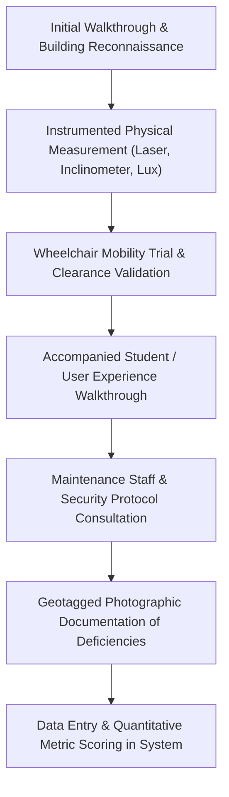

# 🔬 Fieldwork Methodology & Scientific Protocol
## Standardized Physical Measurement & Data Collection Framework

> **Lead Author & Investigator:** Vaibhav Tiwari  
> **Scientific Rigor Standard:** Empirical In-Situ Verification (No Secondary or Theoretical Estimations)  
> **Regulatory Basis:** RPWD Act 2016 (India) | Harmonised Guidelines 2021 | NBC 2016 | ADA Standards (2010 Reference) | ISO 21542:2021  

---

## 🛠️ Field Instrumentation & Toolchain

All data points gathered during the 216 hours of field research were captured using calibrated scientific instruments:

| Instrument | Model & Specification | Primary Measurement Application | Statutory Threshold Benchmark |
| :--- | :--- | :--- | :--- |
| **Electronic Digital Inclinometer** | Stabila TECH 196 (±0.05° accuracy at 0° and 90°) | Ramp slopes, cross-falls, pathway camber, threshold bevels | Maximum 1:12 (4.76° / 8.33% slope); max 1:50 cross-fall |
| **Laser Distance Measurer** | Bosch Professional GLM 50 C (±1.5 mm precision) | Corridor widths, ceiling heights, elevator shafts, room depth | Minimum 1500mm corridor width; 900mm clear door openings |
| **Steel Calibrated Measuring Tapes** | Stanley FatMax 5m & 30m Dual-Metric | Grab rail heights, toilet pan elevations, counter recesses | Grab rails at 750mm & 900mm; toilet seat at 450–480mm |
| **Precision Digital Lux Meter** | Extech LT300 (0.01 to 40,000 Lux, Cosine-corrected) | Illuminance at floor level across stairs, hallways, rooms | Minimum 150 lux in corridors; 300 lux in classrooms/labs |
| **Acoustic Sound Level Meter** | Reed Instruments R8050 (A & C weighting, 30–130 dB) | Emergency siren audibility, reverberation, loop clarity | Fire alarms ≥75 dBA at bedhead / ≥15 dBA over ambient |
| **Digital Push-Pull Force Gauge** | Chatillon DFE II (0.1 N resolution, peak force hold) | Door opening resistance, door closure spring tensions | Maximum 22.2 N (5.0 lbf) manual opening force |
| **Standard Field Wheelchair** | Karma Ryder 10 (folded width 280mm, deployed 650mm) | Real-world roll-in simulation, door clearance, turning circles | Minimum 1500mm turning circle; 900mm passage clearance |

---

## 📐 The 42-Parameter Evaluation Protocol

Each of the 29 buildings was systematically audited across **8 physical domains** encompassing 42 specific parameters. Every metric was scored according to a strict 3-tier rubric:

* **Score 1.0 (Compliant):** Fully conforms to RPWD Act 2016 and Harmonised Guidelines 2021 dimensions.
* **Score 0.5 (Partial / Deficient):** Feature exists physically but deviates from statutory dimensions (e.g. ramp present but slope is 1:9 instead of 1:12; or elevator present but lacks audio voice annunciator).
* **Score 0.0 (Non-Compliant / Missing):** Feature is absent, inoperable, or presents a direct safety hazard to persons with disabilities.

### Domain 1: Entrances & Approach Paths (RPWD Act §40)
1. **Clear Opening Width:** $\ge 900\text{ mm}$ clear passage between door face and frame stop.
2. **Step-Free Accessibility:** Level transition or ramped approach connecting exterior grade to interior lobby.
3. **Ramp Gradient Compliance:** Longitudinal slope not exceeding $1:12$ ($8.33\%$).
4. **Dual-Tier Continuous Handrails:** Rigid circular rails at $750\text{ mm}$ and $900\text{ mm}$ with $300\text{ mm}$ horizontal end extensions.
5. **Anti-Slip Surfacing:** Textured non-skid surface with static coefficient of friction $\mu \ge 0.6$.
6. **Flush Thresholds:** Vertical threshold change not exceeding $6\text{ mm}$ (or $13\text{ mm}$ with $1:2$ bevel).
7. **Door Operating Effort:** Peak opening force not exceeding $22.2\text{ N}$.

### Domain 2: Vertical Circulation (RPWD Act §40, NBC 2016 §4.4)
8. **Elevator Provision:** Functional passenger elevator servicing 100% of accessible levels.
9. **Tactile & Braille Buttons:** High-relief alphanumeric characters ($1\text{ mm}$ relief) with contracted Grade 2 Braille.
10. **Audible Speech Synthesizer:** Clear bilingual voice announcement declaring current floor and direction of travel.
11. **Cabin Spatial Dimensions:** Interior dimensions $\ge 1100\text{ mm} \times 1400\text{ mm}$ with rear wall viewing mirror.
12. **Staircase Handrails:** Unbroken handrails flanking both sides of all internal and external stairwells.
13. **Tactile Landing Warnings:** Blister tactile ground surface indicators ($300\text{ mm}$ depth) set $300\text{ mm}$ prior to stair nosings.

### Domain 3: Internal Circulation & Corridors (NBC 2016 §4.2)
14. **Corridor Clear Width:** Minimum unobstructed width $\ge 1500\text{ mm}$ allowing simultaneous two-way traffic.
15. **Turning Clearances:** Level $1500\text{ mm} \times 1500\text{ mm}$ turning spaces spaced at intervals not exceeding $30\text{ metres}$.
16. **Protrusion Limits:** Wall-mounted fixtures protruding $> 100\text{ mm}$ must be detectible below $675\text{ mm}$ height.
17. **Flooring Integrity:** Firm, stable, slip-resistant finish without deep-pile carpets or uneven pavers.

### Domain 4: Signage & Wayfinding (RPWD Act §42, WCAG 2.1)
18. **Tactile Door Signage:** Room names and numbers embossed in Braille and raised print at $1400\text{ mm}$ to center.
19. **Tactile Guiding Indicators:** Directional sinusoidal strip tiles installed along primary routes.
20. **Visual Chromatic Contrast:** Minimum $70\%$ light reflectance value (LRV) difference between text and backing plate.
21. **International Symbol of Access (ISA):** Standard blue-and-white wheelchair iconography at all accessible venues.
22. **Tactile Floor Directory:** Entrance tactile floor plan maps with raised room outlines and audio touch beacons.
23. **Mounting Height Standardization:** Instructional signage posted consistently within the $1200\text{–}1600\text{ mm}$ visual field.

### Domain 5: Sanitary Facilities & Washrooms (Harmonised Guidelines §5)
24. **Unisex Accessible Stall:** Minimum one self-contained accessible restroom per building floor.
25. **Doorway & Clear Floor Space:** Outward-swinging door ($\ge 900\text{ mm}$ clear) with $1500\text{ mm}$ interior turning circle.
26. **Grab Bar Configuration:** L-shaped horizontal wall rail ($750\text{ mm}$ height) and fold-up counterbalanced side rail.
27. **Universal Identification:** High-contrast raised pictograms and braille plaques on external latch-side wall.
28. **Knee-Clearance Washbasin:** Counter or basin rim at $800\text{ mm}$ with $750\text{ mm}$ vertical knee clearance underneath.
29. **Emergency Distress Pull-Cord:** Red emergency pull-cord hanging to within $100\text{ mm}$ of floor level.

### Domain 6: Emergency Egress & Life Safety (RPWD Act §8)
30. **Accessible Evacuation Routes:** Continuous step-free escape corridor leading directly to open-air assembly points.
31. **Synchronized Visual Strobes:** High-intensity xenon strobe flashers ($75\text{ candela}$ minimum) in all public spaces.
32. **Audible Alarm Sounders:** Emergency horn sounders achieving $\ge 75\text{ dBA}$ sound pressure levels throughout.
33. **PwD Emergency Evacuation Plan:** Formally posted evacuation procedures identifying assigned assistance monitors.
34. **Designated Refuge Areas:** Smoke-partitioned refuge bays on each upper floor equipped with two-way intercoms.

### Domain 7: Instructional Spaces & Furniture (RPWD Act §16)
35. **Wheelchair Desk Integration:** Desks providing $\ge 750\text{ mm}$ knee height, $800\text{ mm}$ width, and $500\text{ mm}$ depth.
36. **Integrated Seating Choice:** Wheelchair spaces positioned in front, middle, and rear rows of lecture auditoriums.
37. **Assistive Listening Loops:** Induction loop systems operating to IEC 60118-4 standards in major halls.
38. **Classroom Lux Levels:** Consistent desktop illuminance $\ge 300\text{ lux}$ with glare-shielded luminaires.

### Domain 8: External Infrastructure & Common Amenities
39. **Accessible Parking Bays:** Designated $3600\text{ mm} \times 5000\text{ mm}$ stall located within $50\text{ metres}$ of accessible entrance.
40. **Connecting Kerb Ramps:** Smooth transition kerb cuts with tactile hazard studs at roadway crossings.
41. **Accessible Water Dispensers:** Drinking fountains with operable push-pads mounted at $\le 800\text{ mm}$ height.
42. **Service Counter Inset:** Lowered section of reception or cafeteria counter ($\le 800\text{ mm}$ height, $900\text{ mm}$ length).

---

## 🔄 Triangulation & Verification Workflow

To eliminate subjectivity, every boundary case (such as a ramp measured at 1:11.8 vs. the 1:12 threshold) was measured at three separate longitudinal points (bottom, midpoint, top) and averaged. Photographic records were tagged with exact GPS coordinates and directional headings.
